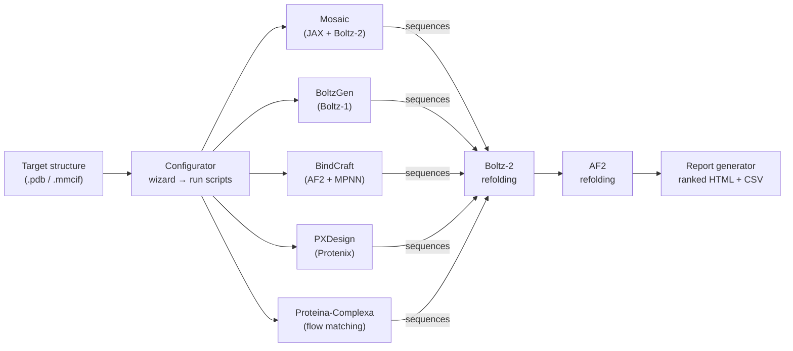

[](https://github.com/damborik22/BindMaster/actions/workflows/ci.yml)
[](LICENSE)
[](https://www.python.org/)
[]()

# BindMaster

A unified toolkit for GPU-accelerated protein binder design — installer, configurator, and evaluator in one repository.

---

## Components

| Component | What it does | Runs in |
|---|---|---|
| `bindmaster install` | Installs design tools (BindCraft, BoltzGen, Mosaic, RFAA, PXDesign, Proteina-Complexa) | bash |
| `bindmaster configure` | Interactive wizard: target → configs → run scripts | system Python |
| `bindmaster evaluate` | Parse outputs, rank designs, optionally re-fold with Boltz-2 and AF2 | Mosaic uv venv |

### Installed tools

| Tool | What it does | Environment |
|---|---|---|
| **BindCraft** | Protein binder design via AlphaFold2 + MPNN + PyRosetta | conda env `BindCraft` (Python 3.10) |
| **BoltzGen** | Structure generation with Boltz-1 diffusion | conda env `BoltzGen` (Python 3.12) |
| **Mosaic** | JAX/Boltz-2-based binder hallucination | uv venv (`Mosaic/.venv`, Python 3.12) |
| **RFAA** | All-atom diffusion + LigandMPNN for ligand binder design | conda env `bindmaster_rfaa` (Python 3.11) |
| **PXDesign** | Protenix-based de novo binder design (diffusion + MPNN + AF2 eval) | conda env `bindmaster_pxdesign` (Python 3.11) |
| **Proteina-Complexa** | NVIDIA flow matching + inference-time optimization | uv venv (`Proteina-Complexa/.venv`, Python 3.12) |

> Each tool runs in its own isolated environment. Environments must not be mixed.

### Architecture



---

## Repository structure

```
BindMaster/
├── bindmaster.py               ← unified CLI entry point (system Python, stdlib only)
├── bindmaster/                 ← tool adapters (RFAA, PXDesign), scoring, feature flags
├── install/
│   ├── install.sh              ← x86_64 installer
│   └── install_aarch.sh        ← aarch64 / DGX Spark installer
├── configurator/
│   └── configurator.py         ← interactive 5-step setup wizard
├── evaluator/
│   └── evaluator.py            ← lightweight output parser + Boltz-2 re-fold
├── Evaluator/                  ← bundled full evaluation pipeline package
│   ├── binder_comparison/      ← core Python package (extractors, refolding, scoring)
│   ├── scripts/                ← standalone refold scripts (Boltz-2, AF2)
│   ├── docs/                   ← pipeline reference, analysis notes
│   └── envs/                   ← conda env specs (binder-eval, binder-eval-af2)
├── scripts/                    ← helper install scripts (RFAA, PXDesign)
├── tests/                      ← unit + integration tests
├── examples/                   ← example scripts (RFAA, PXDesign)
├── tui/                        ← interactive TUI menu (in development)
├── docs/                       ← development plans and archived plans
├── bindmaster_examples/        ← Mosaic hallucination template (copied on install)
├── tools/
│   └── aarch64/                ← pre-built ARM64 binaries (dssp, DAlphaBall)
├── conda/                      ← local Miniforge3 (standalone mode, gitignored)
├── bin/                        ← local shortcuts (standalone mode, gitignored)
└── runs/                       ← generated run folders (gitignored)
```

Tool directories (`BindCraft/`, `BoltzGen/`, `Mosaic/`, `rf_diffusion_all_atom/`, `LigandMPNN/`, `PXDesign/`, `Proteina-Complexa/`) are cloned by the installer and gitignored.

---

## Quick start

```bash
# 1. Clone (x86_64)
git clone https://github.com/damborik22/BindMaster.git ~/BindMaster
cd ~/BindMaster

# 2. Install tools
bindmaster install             # interactive menu
bindmaster install --tool all  # install everything

# 3. Configure a run
bindmaster configure

# 4. Run (scripts generated by configure)
bash runs/<name>/run_all.sh

# 5. Evaluate results
bindmaster evaluate runs/<name>
```

---

## `bindmaster` CLI reference

```
bindmaster install   [--tool bindcraft|boltzgen|mosaic|rfaa|pxdesign|proteina-complexa|all] [--cuda VERSION]
bindmaster configure [options passed through to configurator.py]
bindmaster evaluate  <run-dir> [--metric METRIC] [--top N] [--refold N] [--target PDB]
bindmaster evaluate  --sequences FILE  [--target PDB] [--refold N]
bindmaster --help
```

### `bindmaster install`

Options:

| Flag | Description |
|---|---|
| `--tool all\|bindcraft\|boltzgen\|mosaic\|rfaa\|pxdesign\|proteina-complexa` | Which tool(s) to install. Omit for interactive menu. |
| `--cuda VERSION` | CUDA version for conda package resolution (default: 12.4) |
| `--skip-examples` | Do not prompt to run bundled examples after install |
| `--standalone` | Force local Miniforge3 install (no system conda needed) |
| `--system-conda` | Use existing system conda instead of local install |
| `--uninstall` | Remove tool environments, directories, and shortcuts |
| `--yes` / `-y` | Non-interactive mode (accept all defaults) |

### `bindmaster configure`

Interactive wizard that:
1. Asks for a target name, PDB file, chain(s), and hotspot residues
2. Sets global binder length and design count, with per-tool overrides
3. Lets you enable/disable each tool (Mosaic, BoltzGen, BindCraft, RFAA, PXDesign, Proteina-Complexa)
4. Writes all config files and shell scripts into `runs/<name>/`
5. Optionally runs the full pipeline immediately

```bash
bindmaster configure
bindmaster configure --status     # show all runs and completion state
bindmaster configure --archive <run>  # tar.gz a run directory
```

#### What gets generated

```
runs/<name>/
├── target/<name>.pdb
├── mosaic/
│   └── hallucinate.py          ← non-interactive, all params injected
├── boltzgen/
│   ├── config.yaml
│   └── outputs/
├── bindcraft/
│   ├── target_settings.json
│   ├── filters.json
│   ├── advanced.json
│   └── outputs/
├── run_mosaic.sh
├── run_boltzgen.sh
├── run_bindcraft.sh
├── run_rfaa.sh
├── run_pxdesign.sh
├── run_proteina_complexa.sh
└── run_all.sh                  ← runs all enabled tools in sequence
```

### `bindmaster evaluate`

Parses design outputs from any combination of tools,
cross-ranks all designs by a configurable metric, and writes a summary.

**Runs inside the Mosaic uv venv** (the only environment that has JAX + Boltz-2).
Mosaic must be installed before running `evaluate`.

#### Run-directory mode

```bash
bindmaster evaluate runs/PDL1_test
bindmaster evaluate runs/PDL1_test --metric ipsae_min --top 20
bindmaster evaluate runs/PDL1_test --refold 5 --target runs/PDL1_test/target/PDL1.pdb
bindmaster evaluate runs/PDL1_test --all-mosaic-designs  # include all ~800 Mosaic designs
```

Output written to `runs/<name>/evaluation/`:
- `summary.csv` — all designs merged and ranked
- `report.txt` — top-N with key metrics
- `refolded/` — Boltz-2 PDB structures (if `--refold N` used)

#### Sequence-only mode

Re-fold a list of bare sequences from any source without a run directory:

```bash
# From a file (one sequence per line, # comments OK)
bindmaster evaluate --sequences my_seqs.txt --refold 3 --target target.pdb

# From stdin
echo "MAEVKLSYVL..." | bindmaster evaluate --sequences - --refold 1
```

#### Ranking metrics

| Metric | Direction | Notes |
|---|---|---|
| `ipsae_min` | higher = better | **Primary metric.** min(bt, tb) iPSAE (DunbrackLab 2025) |
| `iptm` | higher = better | Interface pTM |
| `bt_ipsae` | higher = better | Binder-to-target iPSAE |
| `tb_ipsae` | higher = better | Target-to-binder iPSAE |
| `ranking_loss` | lower = better | Mosaic design-stage ranking loss |
| `plddt_binder_mean` | higher = better | Mean binder pLDDT |
| `pae_bt_mean` | lower = better | Mean binder-to-target PAE |

---

## Installer details

### Requirements

- Linux with an NVIDIA GPU (CUDA driver >= 12.1)
- `git` and `curl` available in PATH
- ~60 GB free disk space
- Conda/Miniforge is **not required** — the installer downloads Miniforge3 automatically if needed

### What happens during install

Each tool goes through:
1. **Clone** — repo cloned at a pinned commit into `BindMaster/<Tool>/`
2. **Environment** — conda env or uv venv created (spinner + full log)
3. **Smoke test** — minimal import or `--help` call
4. **Example** (optional, skippable) — bundled example run
5. **Shortcut** — launcher written to `BindMaster/bin/`

### Non-interactive options

```bash
bash install/install.sh --tool all --yes --skip-examples
bash install/install.sh --tool mosaic
bash install/install.sh --cuda 12.1
bash install/install.sh --uninstall --tool all
```

### Server / HPC installation (no admin required)

BindMaster works fully standalone — no system conda, no admin, no writes outside the project directory:

```bash
git clone https://github.com/damborik22/BindMaster.git
cd BindMaster
python3 bindmaster.py install --tool all --yes

# Add to PATH:
export PATH="$(pwd)/bin:$PATH"
echo 'export PATH="/path/to/BindMaster/bin:$PATH"' >> ~/.bashrc
```

The installer auto-detects if system conda is unavailable or read-only and downloads
Miniforge3 into `BindMaster/conda/`. All environments and shortcuts stay inside the
project directory. To remove everything: `rm -rf BindMaster/`.

---

## Platform / branch

| Branch | Platform | Installer |
|---|---|---|
| `master` | x86_64 Linux + NVIDIA GPU | `install/install.sh` |
| `aarch64` | NVIDIA DGX Spark / Grace-Hopper | `install/install_aarch.sh` |

```bash
# x86_64
git clone https://github.com/damborik22/BindMaster.git

# aarch64 / DGX Spark
git clone -b aarch64 https://github.com/damborik22/BindMaster.git
```

Both branches: `bindmaster install` or `bash install/install.sh`.

### aarch64 notes

- **BindCraft**: ARM64 binaries (`DAlphaBall.gcc`, `dssp`) bundled in `tools/aarch64/` — copied automatically.
- **BoltzGen**: `pip install torch==2.5.1` (aarch64 PyPI wheels include CUDA).
- **Mosaic**: `esmj` excluded on aarch64 (no wheel available).
- **RFAA**: **Not supported on aarch64.** DGL (Deep Graph Library) has no CUDA-enabled aarch64 wheels; the SE3-Transformer requires DGL CUDA operations. Use x86_64 for RFAA.
- **PXDesign**: Full pipeline works on aarch64/Blackwell. The installer applies automatic patches for CUDA arch compatibility (sm_120), JSON serialization, and dataloader config.
- **Proteina-Complexa**: Not yet ported to aarch64. See `docs/plans.md` for the porting plan.

---

## Shortcuts

After installation, launchers are available in `BindMaster/bin/`:

```bash
bindmaster         # unified CLI (install / configure / evaluate)
bindcraft          # activates BindCraft conda env, cd to BindCraft dir
boltzgen           # activates BoltzGen conda env, cd to BoltzGen dir
mosaic             # activates Mosaic uv venv, cd to Mosaic dir
rfaa               # activates RFAA conda env, sets PYTHONPATH
pxdesign           # activates PXDesign conda env
complexa           # activates Proteina-Complexa venv
bindmaster-config  # runs configurator directly (legacy)
```

---

## Reinstalling a tool

```bash
bindmaster install --tool bindcraft
```

Answer **Y** when prompted to remove the existing directory and conda environment.

---

## Monitoring installs

```bash
tail -f ~/BindMaster/install.log         # x86_64
tail -f ~/BindMaster/install_aarch.log   # aarch64
```

---

## Troubleshooting

**BindCraft smoke test fails**
Check `BindCraft/params/` contains `.npz` weight files. If the AF2 download was interrupted, reinstall.

**BoltzGen model download fails**
BoltzGen downloads Boltz-1 weights (~6 GB) on first use. Re-run — it resumes automatically.

**`uv` not found after Mosaic install**
```bash
source ~/.bashrc
```

**`bindmaster evaluate` — Mosaic must be installed**
```bash
bindmaster install --tool mosaic
```

**A tool failed, others succeeded**
```bash
bindmaster install --tool <toolname>
```

**Checking what's installed**
```bash
conda env list                    # shows conda-managed envs
ls BindMaster/bin/                # shows shortcuts
ls BindMaster/conda/envs/         # shows local envs (standalone mode)
```

---

## Development

See [CONTRIBUTING.md](CONTRIBUTING.md) for code style, testing, and PR conventions.

### Linting

```bash
ruff check .                # Python lint
ruff format --check .       # Python format check
shellcheck --shell=bash --severity=warning install/install.sh install/install_aarch.sh
```

### Testing

```bash
docker build -f Dockerfile.test --target base -t bindmaster-test .
docker run --rm -it bindmaster-test bash
./test_env.sh --dry-run     # non-interactive validation
./test_env.sh --gpu         # with GPU
```

---

## License

[MIT](LICENSE)
