[](https://github.com/damborik22/BindMaster/actions/workflows/ci.yml)
[](LICENSE)
[](https://www.python.org/)
[]()

# BindMaster

A unified toolkit for GPU-accelerated protein binder design — installer, configurator, and evaluator in one repository.

---

## Components

| Component | What it does | Runs in |
|---|---|---|
| `bindmaster install` | Installs design tools (BindCraft, BoltzGen, Mosaic, PXDesign, Proteina-Complexa, Protein-Hunter, RFD3; RFAA opt-in legacy) | bash |
| `bindmaster configure` | Interactive wizard: target → configs → run scripts | system Python |
| `bindmaster evaluate` | Parse tool outputs, refold with Boltz-2 + Protenix (and AF3 on aarch64, Part K planned), rank, generate HTML report | Mosaic uv venv |

### Installed tools

| Tool | What it does | Environment | Platform |
|---|---|---|---|
| **BindCraft** | AF2 hallucination + ProteinMPNN + PyRosetta filtering | conda env `BindCraft` (Python 3.10) | x86_64 |
| **BoltzGen** | Boltz-1 diffusion structure generation | conda env `BoltzGen` (Python 3.12) | x86_64 + aarch64 |
| **Mosaic** | JAX / Boltz-2 gradient hallucination | uv venv `Mosaic/.venv` (Python 3.12) | x86_64 |
| **PXDesign** | Protenix-based de novo design (diffusion + MPNN + AF2 eval) | conda env `bindmaster_pxdesign` (Python 3.11) | x86_64 + aarch64 |
| **Proteina-Complexa** | NVIDIA flow matching + inference-time optimisation (best-of-N, beam, MCTS) | uv venv `Proteina-Complexa/.venv` (Python 3.12) | x86_64 (aarch64 needs patches) |
| **Protein-Hunter** | Boltz-2 / Chai-1 hallucination across 6 modalities (protein / cyclic / ligand CCD / ligand SMILES / DNA / RNA) | conda env `bindmaster_protein_hunter` (Python 3.10) | x86_64 |
| **RFD3** | RosettaCommons foundry diffusion (RFdiffusion3 + ProteinMPNN, BSD-3, commercial-use OK) | conda env `bindmaster_rfd3` (Python 3.12) | x86_64 + aarch64 |
| ~~RFAA~~ *(deprecated)* | RFDiffusionAA + LigandMPNN; superseded by RFD3 — opt in via `--tool rfaa` for reproducing existing runs | conda env `bindmaster_rfaa` (Python 3.11) | x86_64 only |

> Each tool runs in its own isolated environment. Environments must not be mixed. Tools omitted from the interactive menu and `--tool all` are listed in italics above; install them explicitly with `--tool <name>`.

### Architecture

```mermaid
flowchart LR
    Input["Target structure\n(.pdb / .mmcif)"]
    Config["Configurator\nwizard → run scripts"]

    subgraph Design["Design tools (run in parallel via run_all.sh)"]
        BC["BindCraft\n(AF2 + MPNN + PyRosetta)"]
        BG["BoltzGen\n(Boltz-1 diffusion)"]
        Mosaic["Mosaic\n(JAX + Boltz-2 hallucination)"]
        PX["PXDesign\n(Protenix + MPNN + AF2 eval)"]
        PC["Proteina-Complexa\n(flow matching + ITO)"]
        PH["Protein-Hunter\n(Boltz-2, 6 modalities)"]
        RFD3["RFD3\n(foundry diffusion + MPNN)"]
    end

    Extract["Extractors\n(one per tool → unified FASTA)"]

    subgraph Refold["Refolding engines (independent cross-validation)"]
        Boltz2["Boltz-2\n(Mosaic venv, live, all platforms)"]
        Protenix["Protenix v0.5.0\n(bindmaster_pxdesign env, live, x86_64)"]
        AF3["AF3 v3.0.2\n(binder-eval-af3 env, Part K planned, aarch64 only)"]
    end

    Report["Report generator\nranked HTML + CSV\n(agreement_count, ipsae_min)"]

    Input --> Config
    Config --> Design
    Design -->|tool-specific outputs| Extract
    Extract -->|FASTA of binders| Boltz2
    Boltz2 --> Protenix
    Protenix --> Report
    Boltz2 -.-> AF3
    AF3 -.-> Report
    Boltz2 --> Report
```



The dotted edges are planned (Part K AF3 refolding for DGX Spark). RFAA is omitted from the diagram because it is deprecated and not part of the default `run_all.sh`; install it explicitly to reproduce older runs.

---

## Repository structure

```
BindMaster/
├── bindmaster.py               ← unified CLI entry point (system Python, stdlib only)
├── bindmaster/                 ← Python package: tool adapter base, scoring, scheduler, feature flags
├── install/
│   ├── install.sh              ← x86_64 installer
│   └── install_aarch.sh        ← aarch64 / DGX Spark installer
├── configurator/
│   └── configurator.py         ← interactive 5-step setup wizard
├── evaluator/
│   └── evaluator.py            ← lightweight output parser + Boltz-2 re-fold
├── Evaluator/                  ← bundled full evaluation pipeline package
│   ├── binder_comparison/      ← core Python package (extractors, refolding, scoring)
│   ├── scripts/                ← standalone refold scripts (refold_boltz2.py, refold_protenix.py; refold_af3.py planned, Part K)
│   ├── docs/                   ← pipeline reference, analysis notes
│   └── envs/                   ← conda env specs (binder-eval; binder-eval-af3 [aarch64 only, Part K, todo])
├── scripts/                    ← helper install scripts (RFAA, PXDesign)
├── tests/                      ← unit + integration tests
├── examples/                   ← example scripts (RFAA, PXDesign)
├── tui/                        ← interactive TUI menu (in development)
├── docs/                       ← development plans and archived plans
├── bindmaster_examples/        ← canonical run-script templates (Mosaic hallucination, RFD3, Protein-Hunter)
├── tools/
│   └── aarch64/                ← pre-built ARM64 binaries (dssp, DAlphaBall)
├── conda/                      ← local Miniforge3 (standalone mode, gitignored)
├── bin/                        ← local shortcuts (standalone mode, gitignored)
└── runs/                       ← generated run folders (gitignored)
```

Tool directories (`BindCraft/`, `BoltzGen/`, `Mosaic/`, `PXDesign/`, `Proteina-Complexa/`, `Protein-Hunter/`, `rf_diffusion_all_atom/`, `LigandMPNN/`) are cloned by the installer and gitignored. RFD3 has no clone — it is pip-installed (`rc-foundry`) into `bindmaster_rfd3` and stores weights at `weights/foundry/`.

---

## Quick start

```bash
# 1. Clone (x86_64)
git clone https://github.com/damborik22/BindMaster.git ~/BindMaster
cd ~/BindMaster

# 2. Install tools
bindmaster install             # interactive menu
bindmaster install --tool all  # install everything

# 3. Configure a run
bindmaster configure

# 4. Run (scripts generated by configure)
bash runs/<name>/run_all.sh

# 5. Evaluate results
bindmaster evaluate runs/<name>
```

---

## `bindmaster` CLI reference

```
bindmaster install   [--tool bindcraft|boltzgen|mosaic|pxdesign|proteina-complexa|protein-hunter|rfd3|rfaa|all]
                     [--cuda VERSION] [--standalone] [--system-conda] [--yes] [--skip-examples]
bindmaster configure [options passed through to configurator.py]
bindmaster evaluate  <run-dir> [--metric METRIC] [--top N] [--refold N] [--target PDB] [--all-mosaic-designs]
bindmaster evaluate  --sequences FILE  [--target PDB] [--refold N]
bindmaster --help
```

### `bindmaster install`

Options:

| Flag | Description |
|---|---|
| `--tool all\|bindcraft\|boltzgen\|mosaic\|pxdesign\|proteina-complexa\|protein-hunter\|rfd3\|rfaa` | Which tool(s) to install. Omit for interactive menu. `all` installs current-generation tools — RFAA is legacy and only installs with an explicit `--tool rfaa`. |
| `--cuda VERSION` | CUDA version for conda package resolution (default: 12.4) |
| `--skip-examples` | Do not prompt to run bundled examples after install |
| `--standalone` | Force local Miniforge3 install (no system conda needed) |
| `--system-conda` | Use existing system conda instead of local install |
| `--uninstall` | Remove tool environments, directories, and shortcuts |
| `--yes` / `-y` | Non-interactive mode (accept all defaults) |

### `bindmaster configure`

Interactive wizard that:
1. Asks for a target name, PDB file, chain(s), and hotspot residues
2. Sets global binder length and design count, with per-tool overrides
3. Lets you enable/disable each current-generation tool (Mosaic, BoltzGen, BindCraft, PXDesign, Proteina-Complexa, Protein-Hunter, RFD3)
4. Writes all config files and shell scripts into `runs/<name>/`
5. Optionally runs the full pipeline immediately

> RFAA is not offered by the configurator; install it via `--tool rfaa` and write the run script by hand if you need to reproduce existing runs.

```bash
bindmaster configure
bindmaster configure --status     # show all runs and completion state
bindmaster configure --archive <run>  # tar.gz a run directory
```

#### What gets generated

```
runs/<name>/
├── target/<name>.pdb
├── mosaic/
│   └── hallucinate.py          ← non-interactive, all params injected
├── boltzgen/
│   ├── config.yaml
│   └── outputs/
├── bindcraft/
│   ├── target_settings.json
│   ├── filters.json
│   ├── advanced.json
│   └── outputs/
├── pxdesign/
├── proteina_complexa/
├── protein_hunter/
├── rfd3/
├── run_mosaic.sh
├── run_boltzgen.sh
├── run_bindcraft.sh
├── run_pxdesign.sh
├── run_proteina_complexa.sh
├── run_protein_hunter.sh
├── run_rfd3.sh
├── run_evaluate.sh
└── run_all.sh                  ← runs all enabled tools in sequence
```

Each per-tool run script writes a `runs/<name>/<tool>/settings.json` capturing tool version, design parameters, target sequence, and GPU info before the design step begins — so a run is self-describing without grepping the parent script (which may have been edited since).

### `bindmaster evaluate`

Parses design outputs from any combination of tools,
cross-ranks all designs by a configurable metric, and writes a summary.

**Refolding engines:**

| Engine | CLI subcommand | Env | Platform | Status |
|---|---|---|---|---|
| **Boltz-2** | `binder-compare refold-boltz2` | Mosaic `.venv` | x86 + aarch64 | Live — primary refolder, ipSAE scoring (DunbrackLab 2025 formula) |
| **Protenix v0.5.0** | `binder-compare refold-protenix` | `bindmaster_pxdesign` conda | x86_64 | Live — ByteDance's open-source AF3 reimplementation; no separate env required |
| **AF3 v3.0.2** | `binder-compare refold-af3` | `binder-eval-af3` conda | aarch64 only | Planned (Part K) — schema columns reserved, runner not yet shipped |

Cross-engine columns are namespaced (`boltz_pae_*`, `protenix_*`, `af3_*`). The `agreement_count` column (0–3 on Spark, 0–2 on x86) counts engines whose `ipsae_min > 0.61` and is the primary tiebreaker after `ipsae_min`. Boltz-2 must run first because it produces the canonical sequence list the other engines refold; Protenix is auto-detected by `evaluate.sh` when `bindmaster_pxdesign` exists and can be skipped with `--skip-protenix`.

#### Run-directory mode

```bash
bindmaster evaluate runs/PDL1_test
bindmaster evaluate runs/PDL1_test --metric ipsae_min --top 20
bindmaster evaluate runs/PDL1_test --refold 5 --target runs/PDL1_test/target/PDL1.pdb
bindmaster evaluate runs/PDL1_test --all-mosaic-designs  # include all ~800 Mosaic designs
```

Output written to `runs/<name>/evaluation/`:
- `summary.csv` — all designs merged and ranked
- `report.txt` — top-N with key metrics
- `refolded/` — Boltz-2 PDB structures (if `--refold N` used)

#### Sequence-only mode

Re-fold a list of bare sequences from any source without a run directory:

```bash
# From a file (one sequence per line, # comments OK)
bindmaster evaluate --sequences my_seqs.txt --refold 3 --target target.pdb

# From stdin
echo "MAEVKLSYVL..." | bindmaster evaluate --sequences - --refold 1
```

#### Ranking metrics

| Metric | Direction | Notes |
|---|---|---|
| `ipsae_min` | higher = better | **Primary metric.** min(bt, tb) iPSAE (DunbrackLab 2025) |
| `iptm` | higher = better | Interface pTM |
| `bt_ipsae` | higher = better | Binder-to-target iPSAE |
| `tb_ipsae` | higher = better | Target-to-binder iPSAE |
| `ranking_loss` | lower = better | Mosaic design-stage ranking loss |
| `plddt_binder_mean` | higher = better | Mean binder pLDDT |
| `pae_bt_mean` | lower = better | Mean binder-to-target PAE |

---

## Installer details

### Requirements

- Linux with an NVIDIA GPU (CUDA driver >= 12.1)
- `git` and `curl` available in PATH
- ~60 GB free disk space
- Conda/Miniforge is **not required** — the installer downloads Miniforge3 automatically if needed

### What happens during install

Each tool goes through:
1. **Clone** — repo cloned at a pinned commit into `BindMaster/<Tool>/`
2. **Environment** — conda env or uv venv created (spinner + full log)
3. **Smoke test** — minimal import or `--help` call
4. **Example** (optional, skippable) — bundled example run
5. **Shortcut** — launcher written to `BindMaster/bin/`

### Non-interactive options

```bash
bash install/install.sh --tool all --yes --skip-examples
bash install/install.sh --tool mosaic
bash install/install.sh --cuda 12.1
bash install/install.sh --uninstall --tool all
```

### Server / HPC installation (no admin required)

BindMaster works fully standalone — no system conda, no admin, no writes outside the project directory:

```bash
git clone https://github.com/damborik22/BindMaster.git
cd BindMaster
python3 bindmaster.py install --tool all --yes

# Add to PATH:
export PATH="$(pwd)/bin:$PATH"
echo 'export PATH="/path/to/BindMaster/bin:$PATH"' >> ~/.bashrc
```

The installer auto-detects if system conda is unavailable or read-only and downloads
Miniforge3 into `BindMaster/conda/`. All environments and shortcuts stay inside the
project directory. To remove everything: `rm -rf BindMaster/`.

---

## Platform / branch

| Branch | Platform | Installer |
|---|---|---|
| `master` | x86_64 Linux + NVIDIA GPU | `install/install.sh` |
| `aarch64` | NVIDIA DGX Spark / Grace-Hopper | `install/install_aarch.sh` |

```bash
# x86_64
git clone https://github.com/damborik22/BindMaster.git

# aarch64 / DGX Spark
git clone -b aarch64 https://github.com/damborik22/BindMaster.git
```

Both branches: `bindmaster install` or `bash install/install.sh`.

### aarch64 notes

- **BindCraft**: ARM64 binaries (`DAlphaBall.gcc`, `dssp`) bundled in `tools/aarch64/` — copied automatically. May fail at smoke-test time because jaxlib CUDA conda packages are not yet available for aarch64.
- **BoltzGen**: PyTorch installed from PyPI without `+cuXXX` suffix (aarch64 wheels already include CUDA).
- **Mosaic**: `esmj` excluded (no aarch64 wheel). `torchtext` may also fail (no Linux aarch64 wheel).
- **PXDesign**: Full pipeline works on aarch64 / Blackwell. The installer applies automatic patches for CUDA arch compatibility (sm_120), JSON serialization (`NumpyEncoder`), and dataloader (`num_workers`) config.
- **Proteina-Complexa**: May need patches — PyTorch Geometric and `torchtext` may lack aarch64 wheels. Core deps (PyTorch 2.7, JAX 0.4.29) are fine. Same approach as Mosaic: mark missing packages with `platform_machine != 'aarch64'` in `pyproject.toml`.
- **Protein-Hunter**: **Not supported on aarch64** — PyRosetta has no aarch64 wheels. The installer prints a warning and skips it.
- **RFD3**: Fully supported on aarch64 — `rc-foundry` is pip-installed, no DGL dependency.
- **RFAA**: **Not supported on aarch64.** DGL (Deep Graph Library) has no CUDA-enabled aarch64 wheels; the SE3-Transformer requires DGL CUDA operations. Use RFD3 instead.
- **AF3 refolding (Part K)**: Planned aarch64-only feature — `binder-eval-af3` env + `refold_af3.py` to be added in a future release. The `af3_*` schema columns and `--af3-results` report flag are already in place.

---

## Shortcuts

After installation, launchers are available in `BindMaster/bin/`:

```bash
bindmaster         # unified CLI (install / configure / evaluate)
bindcraft          # activates BindCraft conda env, cd to BindCraft dir
boltzgen           # activates BoltzGen conda env, cd to BoltzGen dir
mosaic             # activates Mosaic uv venv, cd to Mosaic dir
pxdesign           # activates PXDesign conda env
complexa           # activates Proteina-Complexa venv
protein-hunter     # activates Protein-Hunter conda env
rfd3               # runs `rfd3 design ...` or opens the bindmaster_rfd3 env shell
evaluate           # runs Evaluator/run.sh wizard
rfaa               # activates RFAA conda env (legacy, only installed via --tool rfaa)
bindmaster-config  # runs configurator directly (legacy)
```

---

## Reinstalling a tool

```bash
bindmaster install --tool bindcraft
```

Answer **Y** when prompted to remove the existing directory and conda environment.

---

## Monitoring installs

```bash
tail -f ~/BindMaster/install.log         # x86_64
tail -f ~/BindMaster/install_aarch.log   # aarch64
```

---

## Troubleshooting

**BindCraft smoke test fails**
Check `BindCraft/params/` contains `.npz` weight files. If the AF2 download was interrupted, reinstall.

**BoltzGen model download fails**
BoltzGen downloads Boltz-1 weights (~6 GB) on first use. Re-run — it resumes automatically.

**`uv` not found after Mosaic install**
```bash
source ~/.bashrc
```

**`bindmaster evaluate` — Mosaic must be installed**
```bash
bindmaster install --tool mosaic
```

**A tool failed, others succeeded**
```bash
bindmaster install --tool <toolname>
```

**Checking what's installed**
```bash
conda env list                    # shows conda-managed envs
ls BindMaster/bin/                # shows shortcuts
ls BindMaster/conda/envs/         # shows local envs (standalone mode)
```

---

## Development

See [CONTRIBUTING.md](CONTRIBUTING.md) for code style, testing, and PR conventions.

### Linting

```bash
ruff check .                # Python lint
ruff format --check .       # Python format check
shellcheck --shell=bash --severity=warning install/install.sh install/install_aarch.sh
```

### Testing

```bash
docker build -f Dockerfile.test --target base -t bindmaster-test .
docker run --rm -it bindmaster-test bash
./test_env.sh --dry-run     # non-interactive validation
./test_env.sh --gpu         # with GPU
```

---

## License

[MIT](LICENSE)
