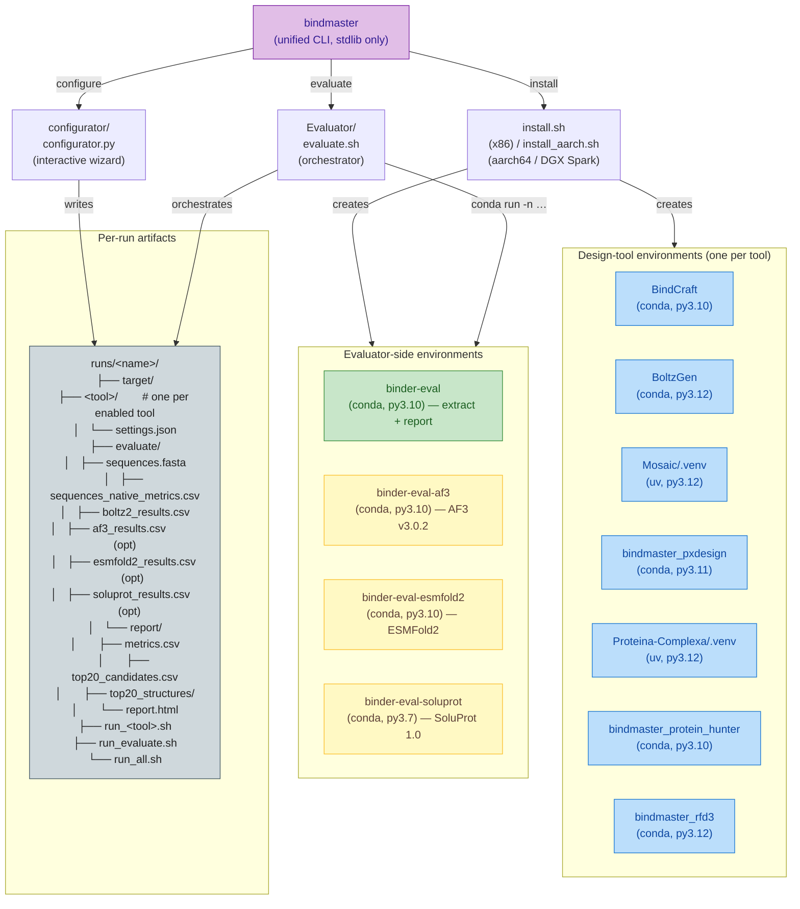

[](https://github.com/damborik22/BinderScout/actions/workflows/ci.yml)
[](LICENSE)
[](https://www.python.org/)
[]()

# BinderScout

A unified toolkit for GPU-accelerated protein binder design — installer, configurator, and evaluator in one repository.

> **Renamed from *BindMaster*.** This project was developed under the internal working name *BindMaster* and is now being released as **BinderScout**. The codebase still uses `bindmaster` in many places — the CLI command (`bindmaster install`, `bindmaster configure`, `bindmaster evaluate`), several conda env names (`bindmaster_pxdesign`, `bindmaster_protein_hunter`, `bindmaster_rfd3`), file and directory names (`bindmaster_examples/`, `bindmaster.py`), and environment variables (`BINDMASTER_*`). These are equivalent to the new name and will be migrated incrementally; functional behavior is unchanged. The GitHub remote is now `damborik22/BinderScout` (the old `damborik22/BindMaster` URL redirects).

---

## Components

| Component | What it does | Runs in |
|---|---|---|
| `bindmaster install` | Installs design tools (BindCraft, BoltzGen, Mosaic, PXDesign, Proteina-Complexa, Protein-Hunter, RFD3) plus the default refold engine ESMFold2; AF3 / SoluProt are separate `--tool` adds | bash |
| `bindmaster configure` | Interactive wizard: target → configs → run scripts | system Python |
| `bindmaster evaluate` | Passthrough to `binder-compare`: parse tool outputs, optionally screen with SoluProt, refold with Boltz-2 / AF3 / ESMFold2, rank by two-stage cross-engine iPTM, generate HTML report | conda env `binder-eval` |

### Installed tools

| Tool | What it does | Environment | Platform |
|---|---|---|---|
| **BindCraft** | AF2 hallucination + ProteinMPNN + PyRosetta filtering | conda env `BindCraft` (Python 3.10) | x86_64 |
| **BoltzGen** | Boltz-1 diffusion structure generation | conda env `BoltzGen` (Python 3.12) | x86_64 + aarch64 |
| **Mosaic** | JAX / Boltz-2 gradient hallucination | uv venv `Mosaic/.venv` (Python 3.12) | x86_64 |
| **PXDesign** | Protenix-based de novo design (diffusion + MPNN + AF2 eval) | conda env `bindmaster_pxdesign` (Python 3.11) | x86_64 + aarch64 |
| **Proteina-Complexa** | NVIDIA flow matching + inference-time optimisation (best-of-N, beam, MCTS) | uv venv `Proteina-Complexa/.venv` (Python 3.12) | x86_64 (aarch64 needs patches) |
| **Protein-Hunter** | Boltz-2 / Chai-1 hallucination across 6 modalities (protein / cyclic / ligand CCD / ligand SMILES / DNA / RNA) | conda env `bindmaster_protein_hunter` (Python 3.10) | x86_64 |
| **RFD3** | RosettaCommons foundry diffusion (RFdiffusion3 + ProteinMPNN, BSD-3, commercial-use OK) | conda env `bindmaster_rfd3` (Python 3.12) | x86_64 + aarch64 |

> Each tool runs in its own isolated environment. Environments must not be mixed.

### Evaluator engines & filters

The evaluator (`bindmaster evaluate` / `binder-compare`) runs on top of the design tools. Boltz-2 rides the Mosaic venv; ESMFold2 has its own env and is installed by default; AF3 is the canonical big-VRAM cross-check (separate install — gated weights). `evaluate.sh` auto-detects and runs whichever engine envs are present (`--skip-<engine>` to disable). SoluProt is a sequence-only solubility screen that runs **before** refolding so unsoluble designs can be dropped from the FASTA without burning GPU time.

| Engine / filter | Role | Environment | Platform | Install |
|---|---|---|---|---|
| **Boltz-2** | Primary refold engine; ranking reference | `Mosaic/.venv` (rides Mosaic install) | x86_64 + aarch64 | default (with Mosaic) |
| **ESMFold2** | Default refold engine; lightweight, no gated weights; also the `autosize` gate (`chain_iptm_interface`) | conda env `binder-eval-esmfold2` (Python 3.10) | x86_64 + aarch64 | default (in `--tool all`) |
| **AlphaFold 3 v3.0.2** | Canonical cross-engine 2nd opinion on big-VRAM hosts | conda env `binder-eval-af3` (Python 3.10, gated weights) | x86_64 + aarch64; needs ≥100 GB GPU memory | `--tool af3` (gated weights) |
| **SoluProt 1.0** | Sequence-only *E. coli* solubility screen (Hon et al. 2021); filter, not a re-ranker | conda env `binder-eval-soluprot` (Python 3.7, scikit-learn 0.20.x) | x86_64 + aarch64 (aarch64 source-builds scikit-learn 0.20.4 + USEARCH v12 and uses the `--no_tmhmm` model — see [docs/PLAN_soluprot_integration.md](docs/PLAN_soluprot_integration.md)) | `--tool soluprot` |

### Architecture


```mermaid
flowchart LR
    Input["Target structure\n(.pdb / .mmcif)"]
    Config["Configurator\nwizard → run scripts"]

    subgraph Design["Design tools (configurator domain — run via run_all.sh)"]
        BC["BindCraft\n(AF2 + MPNN + PyRosetta)"]
        BG["BoltzGen\n(Boltz-1 diffusion)"]
        MosaicT["Mosaic\n(JAX + Boltz-2 hallucination)"]
        PX["PXDesign\n(Protenix + MPNN + AF2 eval)"]
        PC["Proteina-Complexa\n(flow matching + ITO)"]
        PH["Protein-Hunter\n(Boltz-2 / Chai-1, 6 modalities)"]
        RFD3T["RFD3\n(foundry diffusion + MPNN)"]
    end

    Extract["Extractors\n(one per tool →\nunified FASTA +\nnative_metrics.csv sidecar)"]

    SoluProt["SoluProt 1.0\n(sequence-only solubility screen,\nbinder-eval-soluprot env;\nx86 + aarch64, opt-in)"]

    Drop[("Drop\nbelow threshold\n(--soluprot-filter)")]

    subgraph Refold["Refolding engines (evaluator domain — independent cross-validation)"]
        Boltz2["Boltz-2\n(Mosaic venv;\nprimary engine)"]
        AF3["AF3 v3.0.2\n(binder-eval-af3;\nneeds ≥100 GB GPU)"]
        ESMFold2["ESMFold2\n(binder-eval-esmfold2;\nlightweight, no gated weights)"]
    end

    Report["Report generator\nranked HTML + CSV\n(two-stage: max-screen →\nmean consensus iPTM;\nnative_* columns from extract)"]

    Input --> Config
    Config --> Design
    Design -->|tool-specific outputs| Extract
    Extract -->|FASTA of binders| SoluProt
    SoluProt -->|"filtered FASTA — only with --soluprot-filter"| Drop
    SoluProt -->|FASTA + soluprot_results.csv| Boltz2
    SoluProt --> AF3
    SoluProt --> ESMFold2
    Boltz2 --> Report
    AF3 --> Report
    ESMFold2 --> Report
```

AF3 and ESMFold2 are explicit `--tool` installs; all three engines are then auto-detected by `evaluate.sh` from their conda envs. SoluProt is fully opt-in and acts as a filter, never as a re-ranker — its `soluprot_score` and `soluprot_passes` columns show up in `metrics.csv` alongside the refold scores so users can sort on them if they want.

### Components at a glance


```mermaid
flowchart TB
    classDef gen fill:#bbdefb,stroke:#1976d2,color:#0d47a1
    classDef eng fill:#c8e6c9,stroke:#388e3c,color:#1b5e20
    classDef opt fill:#fff9c4,stroke:#fbc02d,color:#5d4037
    classDef cli fill:#e1bee7,stroke:#7b1fa2,color:#311b92
    classDef arti fill:#cfd8dc,stroke:#455a64,color:#212121

    CLI["bindmaster\n(unified CLI, stdlib only)"]:::cli

    CLI -->|install| InstallSh["install.sh\n(x86) / install_aarch.sh\n(aarch64 / DGX Spark)"]
    CLI -->|configure| Configurator["configurator/\nconfigurator.py\n(interactive wizard)"]
    CLI -->|evaluate| EvaluateSh["Evaluator/\nevaluate.sh\n(orchestrator)"]

    subgraph GenEnvs["Design-tool environments (one per tool)"]
        EnvBC["BindCraft<br/>(conda, py3.10)"]:::gen
        EnvBG["BoltzGen<br/>(conda, py3.12)"]:::gen
        EnvMo["Mosaic/.venv<br/>(uv, py3.12)"]:::gen
        EnvPX["bindmaster_pxdesign<br/>(conda, py3.11)"]:::gen
        EnvPC["Proteina-Complexa/.venv<br/>(uv, py3.12)"]:::gen
        EnvPH["bindmaster_protein_hunter<br/>(conda, py3.10)"]:::gen
        EnvRF["bindmaster_rfd3<br/>(conda, py3.12)"]:::gen
    end

    subgraph EvalEnvs["Evaluator-side environments"]
        EnvEv["binder-eval<br/>(conda, py3.10) — extract + report"]:::eng
        EnvAF3["binder-eval-af3<br/>(conda, py3.10) — AF3 v3.0.2"]:::opt
        EnvESM["binder-eval-esmfold2<br/>(conda, py3.10) — ESMFold2"]:::opt
        EnvSP["binder-eval-soluprot<br/>(conda, py3.7) — SoluProt 1.0"]:::opt
    end

    subgraph Artifacts["Per-run artifacts"]
        Runs["runs/&lt;name&gt;/\n├── target/\n├── &lt;tool&gt;/        # one per enabled tool\n│   └── settings.json\n├── evaluate/\n│   ├── sequences.fasta\n│   ├── sequences_native_metrics.csv\n│   ├── boltz2_results.csv\n│   ├── af3_results.csv           (opt)\n│   ├── esmfold2_results.csv      (opt)\n│   ├── soluprot_results.csv      (opt)\n│   └── report/\n│       ├── metrics.csv\n│       ├── top20_candidates.csv\n│       ├── top20_structures/\n│       └── report.html\n├── run_&lt;tool&gt;.sh\n├── run_evaluate.sh\n└── run_all.sh"]:::arti
    end

    InstallSh -->|creates| GenEnvs
    InstallSh -->|creates| EvalEnvs
    Configurator -->|writes| Runs
    EvaluateSh -->|orchestrates| Runs
    EvaluateSh -->|conda run -n …| EvalEnvs
```

Solid blue boxes are the seven design tools' isolated environments; green / yellow boxes are the four evaluator environments (the three yellow ones are opt-in via `--tool af3 / esmfold2 / soluprot`). The grey panel shows the per-run output layout the configurator generates and `evaluate.sh` fills in.

---

## Repository structure

```
BindMaster/
├── bindmaster.py               ← unified CLI dispatcher (system Python, stdlib only)
├── tui/
│   └── app.py                  ← interactive curses menu + numbered fallback
├── install/
│   ├── install.sh              ← x86_64 installer
│   └── install_aarch.sh        ← aarch64 / DGX Spark installer
├── configurator/
│   └── configurator.py         ← interactive setup wizard (steps 1–7, ~80 prompts)
├── evaluator_legacy/
│   └── evaluator.py            ← retired single-file evaluator (evaluate now → binder-compare)
├── Evaluator/                  ← bundled full evaluation pipeline package
│   ├── binder_comparison/      ← core Python package (extractors, refolding, scoring)
│   ├── scripts/                ← standalone refold scripts (refold_boltz2.py, refold_af3.py, refold_esmfold2.py)
│   ├── docs/                   ← pipeline reference, analysis notes
│   └── envs/                   ← conda env specs (binder-eval, binder-eval-af3 [needs ≥100 GB GPU memory])
├── .claude/
│   └── skills/                 ← Claude Code skills (bindmaster-orchestrator, bindmaster-worker)
├── scripts/                    ← helper install scripts (PXDesign)
├── tests/                      ← unit + integration tests
├── docs/                       ← development plans, completed plans, environments reference, scientific notes
├── bindmaster_examples/        ← canonical run-script templates (Mosaic hallucination, RFD3, Protein-Hunter)
├── tools/
│   └── aarch64/                ← pre-built ARM64 binaries (dssp, DAlphaBall)
├── conda/                      ← local Miniforge3 (standalone mode, gitignored)
├── bin/                        ← local shortcuts (standalone mode, gitignored)
└── runs/                       ← generated run folders (gitignored)
```

Tool directories (`BindCraft/`, `BoltzGen/`, `Mosaic/`, `PXDesign/`, `Proteina-Complexa/`, `Protein-Hunter/`) are cloned by the installer and gitignored. RFD3 has no clone — it is pip-installed (`rc-foundry`) into `bindmaster_rfd3` and stores weights at `weights/foundry/`. AF3 v3.0.2 refolding runs in its own `binder-eval-af3` conda env on any host with ≥100 GB GPU memory (DGX Spark today; H200 / GH200 should also work); `refold_af3.py` is the canonical wrapper.

---

## Quick start

```bash
# 1. Clone (x86_64)
git clone https://github.com/damborik22/BinderScout.git ~/BinderScout
cd ~/BinderScout

# 2. Install tools
bindmaster install             # interactive menu
bindmaster install --tool all  # install everything

# 3. Configure a run
bindmaster configure

# 4. Run (scripts generated by configure)
bash runs/<name>/run_all.sh

# 5. Evaluate results — `bindmaster evaluate` forwards to the binder-compare CLI
#    (the configurator also writes runs/<name>/run_evaluate.sh, which drives Evaluator/evaluate.sh)
bash runs/<name>/run_evaluate.sh
# …or call the pipeline directly:
bindmaster evaluate run --mosaic runs/<name>/mosaic --bindcraft runs/<name>/bindcraft \
                        --target-seq "<TARGET_SEQ>" -o runs/<name>/evaluate
```

> **Prefer menus to flags?** Run `bindmaster` with no arguments for the interactive TUI —
> installer checkbox menu, configurator wizard, run launcher and status view.
> **[docs/walkthrough_and_dataflow.html](docs/walkthrough_and_dataflow.html)** reproduces
> every screen you will see, verbatim, and traces the full data flow: what each of the seven
> tools writes, which file and column the pipeline reads from it, and what happens to those
> numbers on the way to the report.

---

## `bindmaster` CLI reference

```
bindmaster install   [--tool bindcraft|boltzgen|mosaic|pxdesign|proteina-complexa|protein-hunter|rfd3|all]
                     [--tool af3|soluprot]             # extra evaluator engines (esmfold2 ships in --tool all)
                     [--cuda VERSION] [--standalone] [--system-conda] [--yes] [--skip-examples]
bindmaster configure [options passed through to configurator.py]
bindmaster evaluate  <binder-compare args>             # passthrough, e.g. run / extract / report / autosize
bindmaster --help
```

### `bindmaster install`

Options:

| Flag | Description |
|---|---|
| `--tool all\|bindcraft\|boltzgen\|mosaic\|pxdesign\|proteina-complexa\|protein-hunter\|rfd3` | Which design tool(s) to install. Omit for interactive menu. |
| `--tool esmfold2` | ESMFold2 refolder — **default** (already in `--tool all`); lightweight, no gated weights; also the `autosize` gate. Listed here for explicit re-install. |
| `--tool af3\|soluprot` | Extra evaluator tools (not in `--tool all`). `af3` = AlphaFold 3 v3.0.2 (≥100 GB GPU, gated weights — canonical cross-check). `soluprot` = solubility screen (x86 needs the SoluProt + USEARCH downloads; **aarch64**: run `bash install/install_aarch.sh --tool soluprot` — it source-builds scikit-learn 0.20.4 + USEARCH v12 and uses the `--no_tmhmm` model). |
| `--cuda VERSION` | CUDA version for conda package resolution (default: 12.4) |
| `--skip-examples` | Do not prompt to run bundled examples after install |
| `--standalone` | Force local Miniforge3 install (no system conda needed) |
| `--system-conda` | Use existing system conda instead of local install |
| `--uninstall` | Remove tool environments, directories, and shortcuts |
| `--yes` / `-y` | Non-interactive mode (accept all defaults) |

### `bindmaster configure`

Interactive wizard that:
1. Asks for a target name, PDB file, chain(s), and hotspot residues
2. Sets global binder length and design count, with per-tool overrides
3. Lets you enable/disable each current-generation tool (Mosaic, BoltzGen, BindCraft, PXDesign, Proteina-Complexa, Protein-Hunter, RFD3)
4. Writes all config files and shell scripts into `runs/<name>/`
5. Optionally runs the full pipeline immediately

```bash
bindmaster configure
bindmaster configure --status     # show all runs and completion state
bindmaster configure --archive <run>  # tar.gz a run directory
```

#### What gets generated

```
runs/<name>/
├── target/<name>.pdb
├── mosaic/
│   └── hallucinate.py          ← non-interactive, all params injected
├── boltzgen/
│   ├── config.yaml
│   └── outputs/
├── bindcraft/
│   ├── target_settings.json
│   ├── filters.json
│   ├── advanced.json
│   └── outputs/
├── pxdesign/
├── proteina_complexa/
├── protein_hunter/
├── rfd3/
├── run_mosaic.sh
├── run_boltzgen.sh
├── run_bindcraft.sh
├── run_pxdesign.sh
├── run_proteina_complexa.sh
├── run_protein_hunter.sh
├── run_rfd3.sh
├── run_evaluate.sh
└── run_all.sh                  ← runs all enabled tools in sequence
```

Each per-tool run script writes a `runs/<name>/<tool>/settings.json` capturing tool version, design parameters, target sequence, and GPU info before the design step begins — so a run is self-describing without grepping the parent script (which may have been edited since).

### `bindmaster evaluate`

Parses design outputs from any combination of tools,
cross-ranks all designs by a configurable metric, and writes a summary.

**Refolding engines (canonical pipeline):**

| Engine | CLI subcommand | Env | Where it runs |
|---|---|---|---|
| **Boltz-2** | `binder-compare refold-boltz2` | Mosaic `.venv` | Anywhere with a 24 GB GPU |
| **AF3 v3.0.2** | `binder-compare refold-af3` | `binder-eval-af3` conda | Any host with ≥100 GB GPU memory — DGX Spark (aarch64), H200 (x86_64), GH200, etc. Full AF3 inference doesn't fit on consumer 24 GB GPUs. |

Cross-engine columns are namespaced (`boltz_pae_*`, `af3_*`, `esmfold2_*`). The **default ranking is two-stage**: stage 1 screens by `consensus_iptm` (max engine iPTM) keeping the top 50%, stage 2 ranks survivors by the mean engine iPTM (`binder-compare report --rank-by two_stage`). `ipsae_min` (DunbrackLab 2025 formula) and `agreement_count` remain as secondary/diagnostic columns. AF3 and ESMFold2 produce token-order PAE which the evaluator transposes to match Boltz-2's `[binder|target]` order.

> Evaluation = Boltz-2 + AF3 + ESMFold2, exactly three independent engines. Each is auto-detected from its conda env and can be skipped with `--skip-<engine>`.

#### Usage — `bindmaster evaluate` forwards to `binder-compare`

`bindmaster evaluate <args>` runs the `binder-compare` CLI in the `binder-eval` conda env. The full pipeline (extract → refold → two-stage report) is one command:

```bash
binder-compare run --mosaic runs/PDL1/mosaic --bindcraft runs/PDL1/bindcraft \
                   --target-seq "MKTAYIAKQR…" -o runs/PDL1/evaluate
```

Individual steps are also subcommands: `extract`, `refold-boltz2`, `refold-af3`, `refold-esmfold2`, `report`, and `autosize`. The configurator-generated `runs/<name>/run_evaluate.sh` wraps `Evaluator/evaluate.sh`, which auto-detects the installed engines and drives the whole thing.

Report output lands in `…/evaluate/report/` — `report.html`, `metrics.csv`, and `top20_candidates.csv`, ranked two-stage.

#### `autosize` — adaptive sampling

`binder-compare autosize` decides whether enough **independent** designs (backbones, not sequences) have cleared the ESMFold2 `chain_iptm_interface` gate, and sizes the next batch if not — single-shot verdict or a `--loop` that drives generate → refold → decide. Tier-aware gate (`--tier permissive|default|strict`) with a per-tool `--budget-cap`.

#### Ranking metrics

| Metric | Direction | Notes |
|---|---|---|
| `ipsae_min` | higher = better | **Primary metric.** min(bt, tb) iPSAE (DunbrackLab 2025) |
| `iptm` | higher = better | Interface pTM |
| `bt_ipsae` | higher = better | Binder-to-target iPSAE |
| `tb_ipsae` | higher = better | Target-to-binder iPSAE |
| `ranking_loss` | lower = better | Mosaic design-stage ranking loss |
| `plddt_binder_mean` | higher = better | Mean binder pLDDT |
| `pae_bt_mean` | lower = better | Mean binder-to-target PAE |

---

## Installer details

### Requirements

- Linux with an NVIDIA GPU (CUDA driver >= 12.1)
- `git` and `curl` available in PATH
- ~60 GB free disk space
- Conda/Miniforge is **not required** — the installer downloads Miniforge3 automatically if needed

### What happens during install

Each tool goes through:
1. **Clone** — repo cloned at a pinned commit into `BindMaster/<Tool>/`
2. **Environment** — conda env or uv venv created (spinner + full log)
3. **Smoke test** — minimal import or `--help` call
4. **Example** (optional, skippable) — bundled example run
5. **Shortcut** — launcher written to `BindMaster/bin/`

### Non-interactive options

```bash
bash install/install.sh --tool all --yes --skip-examples
bash install/install.sh --tool mosaic
bash install/install.sh --cuda 12.1
bash install/install.sh --tool all --yes --force        # replace existing checkouts/envs
bash install/install.sh --tool all --yes --skip-preflight
bash install/install.sh --uninstall --tool all
```

> **`--yes` is safe to re-run.** It auto-confirms the *safe* prompts ("Proceed with
> installation?", "Run the example?") but auto-answers **no** to the destructive ones
> — re-cloning a tool repo, re-creating a conda env, removing the local Miniforge3 —
> so a repeat install keeps existing checkouts and downloaded weights. Add
> **`--force`** to accept those too, which will delete what is there (including
> `BindCraft/params/*.npz`, ~4 GB of AF2 weights).
>
> ```bash
> bash install/install.sh --tool all --yes            # first install, or safe repair
> bash install/install.sh --tool pxdesign --yes       # resumes; reuses the existing env
> bash install/install.sh --tool pxdesign --yes --force   # rebuilds it from scratch
> ```
>
> A **preflight check** runs before any download: free disk against a per-tool
> estimate (aborts if short), GPU presence and pypi.org reachability (advisory).
> `--skip-preflight` bypasses it.

### Server / HPC installation (no admin required)

BindMaster works fully standalone — no system conda, no admin, no writes outside the project directory:

```bash
git clone https://github.com/damborik22/BindMaster.git
cd BindMaster
python3 bindmaster.py install --tool all --yes

# Add to PATH:
export PATH="$(pwd)/bin:$PATH"
echo 'export PATH="/path/to/BindMaster/bin:$PATH"' >> ~/.bashrc
```

The installer auto-detects if system conda is unavailable or read-only and downloads
Miniforge3 into `BindMaster/conda/`. All environments and shortcuts stay inside the
project directory. To remove everything: `rm -rf BindMaster/`.

---

## Platform / branch

| Branch | Platform | Installer |
|---|---|---|
| `master` | x86_64 Linux + NVIDIA GPU | `install/install.sh` |
| `aarch64` | NVIDIA DGX Spark / Grace-Hopper | `install/install_aarch.sh` |

```bash
# x86_64
git clone https://github.com/damborik22/BinderScout.git

# aarch64 / DGX Spark
git clone -b aarch64 https://github.com/damborik22/BinderScout.git
```

Both branches: `bindmaster install` or `bash install/install.sh`.

### aarch64 notes

- **BindCraft**: ARM64 binaries (`DAlphaBall.gcc`, `dssp`) bundled in `tools/aarch64/` — copied automatically. May fail at smoke-test time because jaxlib CUDA conda packages are not yet available for aarch64.
- **BoltzGen**: PyTorch installed from PyPI without `+cuXXX` suffix (aarch64 wheels already include CUDA).
- **Mosaic**: `esmj` excluded (no aarch64 wheel). `torchtext` may also fail (no Linux aarch64 wheel).
- **PXDesign**: Full pipeline works on aarch64 / Blackwell. The installer applies automatic patches for CUDA arch compatibility (sm_120), JSON serialization (`NumpyEncoder`), and dataloader (`num_workers`) config.
- **Proteina-Complexa**: May need patches — PyTorch Geometric and `torchtext` may lack aarch64 wheels. Core deps (PyTorch 2.7, JAX 0.4.29) are fine. Same approach as Mosaic: mark missing packages with `platform_machine != 'aarch64'` in `pyproject.toml`. **Not wired into `install_aarch.sh`** — `--tool proteina-complexa` there exits with that explanation.
- **Protein-Hunter**: **Not supported on aarch64** — PyRosetta has no aarch64 wheels. `install_aarch.sh` rejects `--tool protein-hunter` with that reason.
- **RFD3**: `install_aarch.sh --tool rfd3` installs it (cu130 torch wheels, `rc-foundry[rfd3,mpnn]`, weights + ProteinMPNN checkpoint into `weights/foundry/`). Opt-in rather than part of `--tool all` because it is **not yet validated on aarch64 hardware**.

> **aarch64 tool matrix.** `install/install_aarch.sh` accepts `all`, `bindcraft`,
> `boltzgen`, `mosaic`, `evaluator`, `pxdesign`, `rfd3`, `af3`, `esmfold2`,
> `soluprot`. `--tool all` installs BindCraft, BoltzGen, Mosaic, Evaluator, PXDesign
> and **ESMFold2** (the default refold engine).
>
> - **RFD3 is opt-in on aarch64:** `--tool rfd3`. It is pure pip with no DGL
>   dependency so it should work, but it has **not been validated on aarch64
>   hardware** — which is why it is not in `--tool all`. Please report results.
> - **Protein-Hunter and Proteina-Complexa are refused** with an explicit reason
>   (PyRosetta has no aarch64 wheels; PyG/torchtext may not either).
> - `bindmaster install` now selects the installer for the host architecture
>   automatically, so you no longer need to invoke `install_aarch.sh` by hand — the
>   TUI's "Install tools" does the same.
- **AF3 refolding**: Live on aarch64 / DGX Spark via the `binder-eval-af3` conda env and `binder-compare refold-af3`. Not aarch64-exclusive — AF3 runs anywhere with ≥100 GB GPU memory (an H200, GH200, etc. should work too); DGX Spark is just our primary host because Spark is where the unified memory headroom lives.

---

## Shortcuts

After installation, launchers are available in `BindMaster/bin/`:

```bash
bindmaster         # unified CLI (install / configure / evaluate)
bindcraft          # activates BindCraft conda env, cd to BindCraft dir
boltzgen           # activates BoltzGen conda env, cd to BoltzGen dir
mosaic             # activates Mosaic uv venv, cd to Mosaic dir
pxdesign           # activates PXDesign conda env
complexa           # activates Proteina-Complexa venv
protein-hunter     # activates Protein-Hunter conda env
rfd3               # runs `rfd3 design ...` or opens the bindmaster_rfd3 env shell
evaluate           # runs Evaluator/run.sh wizard
bindmaster-config  # runs configurator directly (legacy)
```

---

## Reinstalling a tool

```bash
bindmaster install --tool bindcraft
```

Answer **Y** when prompted to remove the existing directory and conda environment.

---

## Monitoring installs

```bash
tail -f ~/BindMaster/install.log         # x86_64
tail -f ~/BindMaster/install_aarch.log   # aarch64
```

---

## Troubleshooting

**BindCraft smoke test fails**
Check `BindCraft/params/` contains `.npz` weight files. If the AF2 download was interrupted, reinstall.

**BoltzGen model download fails**
BoltzGen downloads Boltz-1 weights (~6 GB) on first use. Re-run — it resumes automatically.

**`uv` not found after Mosaic install**
```bash
source ~/.bashrc
```

**`bindmaster evaluate` — Mosaic must be installed**
```bash
bindmaster install --tool mosaic
```

**A tool failed, others succeeded**
```bash
bindmaster install --tool <toolname>
```

**Checking what's installed**
```bash
conda env list                    # shows conda-managed envs
ls BindMaster/bin/                # shows shortcuts
ls BindMaster/conda/envs/         # shows local envs (standalone mode)
```

---

## Known issues

A full read-only audit of the repository — purpose, data flow, dependencies, defects,
non-LLM operability, and GUI options — is at
**[docs/repo_analysis_2026-07-26.html](docs/repo_analysis_2026-07-26.html)**
(31 findings with file:line and a suggested fix order).

The items below are the ones you are most likely to hit while following this README.
Finding IDs refer to that document.

### Following the quick start

| Symptom | Cause | Workaround |
|---|---|---|
| `run_all.sh` prints *"Mosaic requires interactive input"* and exits 1 before any tool runs | The Mosaic block is emitted first and hard-exits unless `mosaic/designs.csv` already exists (F8) | Run `bash runs/<name>/run_mosaic.sh` first, then `run_all.sh`; or disable Mosaic in the wizard |
| Answering *y* to "Run the pipeline now?" never runs RFD3 or Protein-Hunter | `run_pipeline()` dispatches Mosaic, BoltzGen, BindCraft, PXDesign and Proteina-Complexa, but has no branch for RFD3 or Protein-Hunter. They are also absent from the Step 7 preview tree and the "To run later" list (F9) | Run `bash runs/<name>/run_rfd3.sh` / `run_protein_hunter.sh` by hand, or `run_all.sh` (which does cover all seven — with the Mosaic caveat above) |
| The `evaluate` shortcut dies with `Unknown argument: --target-pdb` | `Evaluator/run.sh` passes a flag `evaluate.sh` does not accept (F10) | Call `bash Evaluator/evaluate.sh --sequences … --target-seq "<SEQ>" --output …` directly, or use `runs/<name>/run_evaluate.sh` |
| A run script dies immediately with `nvidia-smi: command not found` | The `settings.json` provenance block runs `nvidia-smi` unguarded under `set -euo pipefail` (F15) | Run on a node where `nvidia-smi` is on `PATH`, and check `--gpu-id` is a real device index |
| RFD3 finished but contributes no designs to the report | `run_evaluate.sh` points `--rfd3` at `rfd3/outputs`, while `run_rfd3.sh` writes `rfd3/sequences.csv` (F3) | Pass `--rfd3 runs/<name>/rfd3` to `binder-compare extract` yourself |
| `binder-compare run --rfd3 …` is rejected by argparse | `run` accepts only `--bindcraft`, `--boltzgen`, `--mosaic`, `--pxdesign` — RFD3, Protein-Hunter and Proteina-Complexa are `extract`-only (F38) | Use `binder-compare extract` (which accepts all seven) followed by the refold + `report` steps, or `runs/<name>/run_evaluate.sh` |
| A mistyped tool directory produces a report that looks complete | `extract` treats a per-tool yield of 0 as non-fatal and exits 0; only an all-empty result fails (F40) | Check the `→ N sequences` line for every tool before starting the refold |
| `binder-compare refold-af2` → `invalid choice` | `Evaluator/README.md` and `docs/pipeline_reference.md` still document the `refold-af2` subcommand and `binder-eval-af2` env, both removed in Part I (F41) | AF2 refolding no longer exists; use Boltz-2 / AF3 / ESMFold2 |

### Correctness caveats worth knowing

- **mmCIF targets ignore your chain answer (F1).** For a `.cif` / `.mmcif` input,
  `extract_sequence_from_cif` reads `_entity_poly` first, which is chain-agnostic and
  picks the **longest** polymer entity — so on a multi-chain structure the target
  sequence may not be the chain you selected. Prefer `.pdb` input, or verify
  `runs/<name>/*/settings.json` shows the target length you expect before committing GPU time.
- **Mosaic hotspots resolve against chain A (F2).** The epitope-index helper reads
  `cfg["target_chain"]` / `cfg["chain"]`, neither of which the wizard sets, so it always
  falls back to `"A"`.
- **Designs refolded by only one engine are ranked against 3-engine designs (F5).**
  `consensus_iptm_mean` skips missing engines, and the two-stage sort does not gate on
  `consensus_iptm_n`. Check that column before trusting a top-ranked design.
- **The report's 3D viewer needs internet (F20).** `report.html` loads NGL from
  `unpkg.com`, so the structure viewer is blank on an air-gapped node even though
  `Evaluator/tools/ngl/` is vendored.
- **`report.html` describes the wrong ranking method (F32).** Its methodology block still
  says Stage 1 screens on `consensus_iptm_mean` and that mean "was selected as default
  over max". Commit `5769064` reverted the default to **max** but did not update
  `visualization/report.py`. The ranking the code performs is max-screen → mean-rank, as
  documented in this README and `CLAUDE.md`; ignore the report's own methodology text
  until it is regenerated from `--screen-metric`.
- **AF3's per-engine ipSAE is missing from `top30_candidates.csv` (F33).** The shortlist
  reads `af3_pae_ipsae_min`, but the writer emits `af3_ipsae_min`, so that column is
  silently absent. Read it
  from `metrics.csv` under the correct names.
- **`wetlab_recommended` is always `False` on a single-engine install (F34).** The gate
  requires `agreement_count >= 2`, which is unreachable when only Boltz-2 is present.

### Running without an LLM

The executable pipeline has **no runtime LLM dependency** — the `.claude/skills/`
packages are an operating manual, not a requirement. Two gaps affect scripted use:

- **The configurator has no headless mode.** Its entire flag surface is `--status` and
  `--archive`; there is no `--config` / `--headless`, and the wizard's config dict is
  never serialised, so a run directory cannot be produced non-interactively or replayed
  (CLAUDE.md deferred item F2).
- **15 of the 22 `binder-compare` subcommands have no human-facing documentation.**
  `analyze-target`, `mature`, `monomer`, `affinity` and `wetlab` are documented only
  inside `.claude/skills/`; `prefilter`, `qc-annotate`, `epitope`, `epitope-map`,
  `beta-check`, `diversity` and `validate` are documented nowhere. Use
  `binder-compare <cmd> --help` in the meantime.

---

## Development

See [CONTRIBUTING.md](CONTRIBUTING.md) for code style, testing, and PR conventions.

### Linting

```bash
ruff check .                # Python lint
ruff format --check .       # Python format check
shellcheck --shell=bash --severity=warning install/install.sh install/install_aarch.sh
```

### Testing

```bash
docker build -f Dockerfile.test --target base -t bindmaster-test .
docker run --rm -it bindmaster-test bash
./test_env.sh --dry-run     # non-interactive validation
./test_env.sh --gpu         # with GPU
```

---

## License

[MIT](LICENSE)
