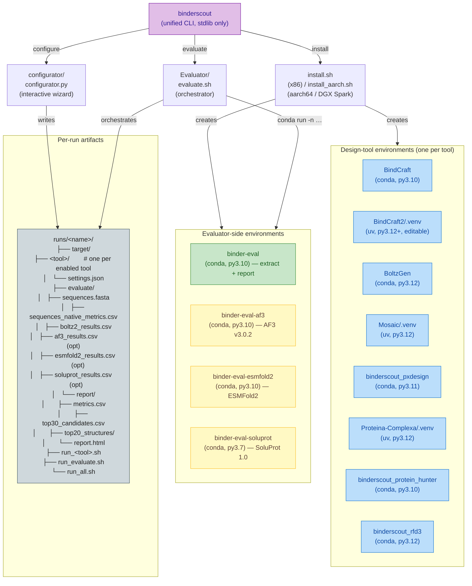

[](https://github.com/damborik22/BinderScout/actions/workflows/ci.yml)
[](LICENSE)
[](https://www.python.org/)
[]()

# BinderScout

A unified toolkit for GPU-accelerated protein binder design — installer, configurator, and evaluator in one repository.

> **Renamed from *BinderScout*.** This project was developed under the internal working name *BinderScout* and is now being released as **BinderScout**. The codebase still uses `binderscout` in many places — the CLI command (`binderscout install`, `binderscout configure`, `binderscout evaluate`), several conda env names (`binderscout_pxdesign`, `binderscout_protein_hunter`, `binderscout_rfd3`), file and directory names (`binderscout_examples/`, `binderscout.py`), and environment variables (`BINDERSCOUT_*`). These are equivalent to the new name and will be migrated incrementally; functional behavior is unchanged. The GitHub remote is now `damborik22/BinderScout` (the old `damborik22/BinderScout` URL redirects).

---

## Components

| Component | What it does | Runs in |
|---|---|---|
| `binderscout install` | Installs design tools (BindCraft, BindCraft 2, BoltzGen, Mosaic, PXDesign, Proteina-Complexa, Protein-Hunter, RFD3) plus the default refold engine ESMFold2 and the SoluProt solubility screen; BindCraft 2 needs its source handed to `--bc2-source`, and AF3 is a separate `--tool` add (gated weights) | bash |
| `binderscout configure` | Interactive wizard: target → configs → run scripts | system Python |
| `binderscout evaluate` | Passthrough to `binder-compare`: parse tool outputs, optionally screen with SoluProt, refold with Boltz-2 / AF3 / ESMFold2, rank by two-stage cross-engine iPTM, generate HTML report | conda env `binder-eval` |

### Installed tools

| Tool | What it does | Environment | Platform |
|---|---|---|---|
| **BindCraft** | AF2 hallucination + ProteinMPNN + PyRosetta filtering | conda env `BindCraft` (Python 3.10) | x86_64 |
| **BindCraft 2** | AF2 hallucination rewritten for JAX — no PyRosetta, no conda. A separate tool, not a newer BindCraft: the two coexist | uv venv `BindCraft2/.venv` (Python ≥3.12, installed editable) | x86_64 + aarch64 (opt-in there) |
| **BoltzGen** | Boltz-1 diffusion structure generation | conda env `BoltzGen` (Python 3.12) | x86_64 + aarch64 |
| **Mosaic** | JAX / Boltz-2 gradient hallucination | uv venv `Mosaic/.venv` (Python 3.12) | x86_64 |
| **PXDesign** | Protenix-based de novo design (diffusion + MPNN + AF2 eval) | conda env `binderscout_pxdesign` (Python 3.11) | x86_64 + aarch64 |
| **Proteina-Complexa** | NVIDIA flow matching + inference-time optimisation (best-of-N, beam, MCTS) | uv venv `Proteina-Complexa/.venv` (Python 3.12) | x86_64; aarch64 opt-in since 2026-09-26 (unvalidated) |
| **Protein-Hunter** | Boltz-2 / Chai-1 hallucination across 6 modalities (protein / cyclic / ligand CCD / ligand SMILES / DNA / RNA) | conda env `binderscout_protein_hunter` (Python 3.10) | x86_64 |
| **RFD3** | RosettaCommons foundry diffusion (RFdiffusion3 + ProteinMPNN, BSD-3, commercial-use OK) | conda env `binderscout_rfd3` (Python 3.12) | x86_64 + aarch64 |

> Each tool runs in its own isolated environment. Environments must not be mixed.

BindCraft 2 is public as of September 2026 — [PacesaLab/BindCraft2](https://github.com/PacesaLab/BindCraft2) —
but it is source-available under its own licence (BindCraft2 Source-Available,
hosting-restricted), not this repository's MIT, so no file of it is vendored
here. The installer stages it from whatever you point `--bc2-source` at,
including that URL:
`binderscout install --tool bindcraft2 --bc2-source <zip|dir>`, or export
`$BINDCRAFT2_SOURCE` once for the machine.
It installs **editable**, which makes `BindCraft2/` itself the installation:
moving or deleting that directory breaks the `bindcraft` command inside its
venv. Under `--tool all` on x86_64 a missing source is a warning and a skip, so
a machine that has never been given the source still installs everything else;
an explicit `--tool bindcraft2` fails instead of pretending to succeed.

BindCraft 2 ranks its own accepted designs on `i_pDAE` — its own metric, sorted
descending, higher being better despite the name reading like an error term.
That rank is read from its file and never recomputed. Its i_pTM is
design-time-biased exactly as BindCraft 1's is, so it never enters
`consensus_iptm_mean`; the cross-engine refold is what places its designs
against the other tools'. The integration is written up in
[docs/PLAN_bindcraft2_integration.md](docs/PLAN_bindcraft2_integration.md).

### Evaluator engines & filters

The evaluator (`binderscout evaluate` / `binder-compare`) runs on top of the design tools. Boltz-2 rides the Mosaic venv; ESMFold2 has its own env and is installed by default; AF3 is the canonical big-VRAM cross-check (separate install — gated weights). `evaluate.sh` auto-detects and runs whichever engine envs are present (`--skip-<engine>` to disable). SoluProt is a sequence-only solubility screen that runs **before** refolding so unsoluble designs can be dropped from the FASTA without burning GPU time.

| Engine / filter | Role | Environment | Platform | Install |
|---|---|---|---|---|
| **Boltz-2** | Primary refold engine; ranking reference | `Mosaic/.venv` (rides Mosaic install) | x86_64 + aarch64 | default (with Mosaic) |
| **ESMFold2** | Default refold engine; lightweight, no gated weights; also the `autosize` gate (`chain_iptm_interface`) | conda env `binder-eval-esmfold2` (Python 3.10) | x86_64 + aarch64 | default (in `--tool all`) |
| **AlphaFold 3 v3.0.2** | Canonical cross-engine 2nd opinion | conda env `binder-eval-af3` (Python 3.10, gated weights) | x86_64 + aarch64; fits a 24 GB card in our size regime — the gate is the **gated weights**, not VRAM | `--tool af3` (gated weights) |
| **SoluProt 1.0** | Sequence-only *E. coli* solubility screen (Hon et al. 2021); filter, not a re-ranker | conda env `binder-eval-soluprot` (Python 3.7, scikit-learn 0.20.x) | x86_64 + aarch64. **Both platforms source-build USEARCH v12** (GPLv3; not redistributed here), so `--tool soluprot` needs a C/C++ toolchain — a failed build fails the install rather than leaving SoluProt silently unable to score. aarch64 additionally source-builds scikit-learn 0.20.4 and uses the `--no_tmhmm` model — see [docs/PLAN_soluprot_integration.md](docs/PLAN_soluprot_integration.md) | in `--tool all` |

### Architecture


```mermaid
flowchart LR
    Input["Target structure\n(.pdb / .mmcif)"]
    Config["Configurator\nwizard → run scripts"]

    subgraph Design["Design tools (configurator domain — run via run_all.sh)"]
        BC["BindCraft\n(AF2 + MPNN + PyRosetta)"]
        BC2["BindCraft 2\n(AF2 hallucination in JAX,\nno PyRosetta)"]
        BG["BoltzGen\n(Boltz-1 diffusion)"]
        MosaicT["Mosaic\n(JAX + Boltz-2 hallucination)"]
        PX["PXDesign\n(Protenix + MPNN + AF2 eval)"]
        PC["Proteina-Complexa\n(flow matching + ITO)"]
        PH["Protein-Hunter\n(Boltz-2 / Chai-1, 6 modalities)"]
        RFD3T["RFD3\n(foundry diffusion + MPNN)"]
    end

    Extract["Extractors\n(one per tool →\nunified FASTA +\nnative_metrics.csv sidecar)"]

    SoluProt["SoluProt 1.0\n(sequence-only solubility screen,\nbinder-eval-soluprot env;\nx86 + aarch64, in --tool all)"]

    Drop[("Drop\nbelow threshold\n(--soluprot-filter)")]

    subgraph Refold["Refolding engines (evaluator domain — independent cross-validation)"]
        Boltz2["Boltz-2\n(Mosaic venv;\nprimary engine)"]
        AF3["AF3 v3.0.2\n(binder-eval-af3;\ngated weights)"]
        ESMFold2["ESMFold2\n(binder-eval-esmfold2;\nlightweight, no gated weights)"]
    end

    Report["Report generator\nranked HTML + CSV\n(two-stage: max-screen →\nmean consensus iPTM;\nnative_* columns from extract)"]

    Input --> Config
    Config --> Design
    Design -->|tool-specific outputs| Extract
    Extract -->|FASTA of binders| SoluProt
    SoluProt -->|"filtered FASTA — only with --soluprot-filter"| Drop
    SoluProt -->|FASTA + soluprot_results.csv| Boltz2
    SoluProt --> AF3
    SoluProt --> ESMFold2
    Boltz2 --> Report
    AF3 --> Report
    ESMFold2 --> Report
```

ESMFold2 and SoluProt are in `--tool all`; AF3 is an explicit `--tool af3` install (gated weights). All three refold engines are then auto-detected by `evaluate.sh` from their conda envs. SoluProt acts as a filter, never as a re-ranker — it only drops designs with `--soluprot-filter` — its `soluprot_score` and `soluprot_passes` columns show up in `metrics.csv` alongside the refold scores so users can sort on them if they want.

### Components at a glance


```mermaid
flowchart TB
    classDef gen fill:#bbdefb,stroke:#1976d2,color:#0d47a1
    classDef eng fill:#c8e6c9,stroke:#388e3c,color:#1b5e20
    classDef opt fill:#fff9c4,stroke:#fbc02d,color:#5d4037
    classDef cli fill:#e1bee7,stroke:#7b1fa2,color:#311b92
    classDef arti fill:#cfd8dc,stroke:#455a64,color:#212121

    CLI["binderscout\n(unified CLI, stdlib only)"]:::cli

    CLI -->|install| InstallSh["install.sh\n(x86) / install_aarch.sh\n(aarch64 / DGX Spark)"]
    CLI -->|configure| Configurator["configurator/\nconfigurator.py\n(interactive wizard)"]
    CLI -->|evaluate| EvaluateSh["Evaluator/\nevaluate.sh\n(orchestrator)"]

    subgraph GenEnvs["Design-tool environments (one per tool)"]
        EnvBC["BindCraft<br/>(conda, py3.10)"]:::gen
        EnvBC2["BindCraft2/.venv<br/>(uv, py3.12+, editable)"]:::gen
        EnvBG["BoltzGen<br/>(conda, py3.12)"]:::gen
        EnvMo["Mosaic/.venv<br/>(uv, py3.12)"]:::gen
        EnvPX["binderscout_pxdesign<br/>(conda, py3.11)"]:::gen
        EnvPC["Proteina-Complexa/.venv<br/>(uv, py3.12)"]:::gen
        EnvPH["binderscout_protein_hunter<br/>(conda, py3.10)"]:::gen
        EnvRF["binderscout_rfd3<br/>(conda, py3.12)"]:::gen
    end

    subgraph EvalEnvs["Evaluator-side environments"]
        EnvEv["binder-eval<br/>(conda, py3.10) — extract + report"]:::eng
        EnvAF3["binder-eval-af3<br/>(conda, py3.10) — AF3 v3.0.2"]:::opt
        EnvESM["binder-eval-esmfold2<br/>(conda, py3.10) — ESMFold2"]:::opt
        EnvSP["binder-eval-soluprot<br/>(conda, py3.7) — SoluProt 1.0"]:::opt
    end

    subgraph Artifacts["Per-run artifacts"]
        Runs["runs/&lt;name&gt;/\n├── target/\n├── &lt;tool&gt;/        # one per enabled tool\n│   └── settings.json\n├── evaluate/\n│   ├── sequences.fasta\n│   ├── sequences_native_metrics.csv\n│   ├── boltz2_results.csv\n│   ├── af3_results.csv           (opt)\n│   ├── esmfold2_results.csv      (opt)\n│   ├── soluprot_results.csv      (opt)\n│   └── report/\n│       ├── metrics.csv\n│       ├── top30_candidates.csv\n│       ├── top20_structures/\n│       └── report.html\n├── run_&lt;tool&gt;.sh\n├── run_evaluate.sh\n└── run_all.sh"]:::arti
    end

    InstallSh -->|creates| GenEnvs
    InstallSh -->|creates| EvalEnvs
    Configurator -->|writes| Runs
    EvaluateSh -->|orchestrates| Runs
    EvaluateSh -->|conda run -n …| EvalEnvs
```

Solid blue boxes are the eight design tools' isolated environments; green / yellow boxes are the four evaluator environments (ESMFold2 and SoluProt ship in `--tool all`; AF3 is opt-in via `--tool af3`). The grey panel shows the per-run output layout the configurator generates and `evaluate.sh` fills in.

---

## Repository structure

```
BinderScout/
├── binderscout.py               ← unified CLI dispatcher (system Python, stdlib only)
├── tui/
│   └── app.py                  ← interactive curses menu + numbered fallback
├── install/
│   ├── install.sh              ← x86_64 installer
│   └── install_aarch.sh        ← aarch64 / DGX Spark installer
├── configurator/
│   └── configurator.py         ← interactive setup wizard (steps 1–7, ~80 prompts)
├── evaluator_legacy/
│   └── evaluator.py            ← retired single-file evaluator (evaluate now → binder-compare)
├── Evaluator/                  ← bundled full evaluation pipeline package
│   ├── binder_comparison/      ← core Python package (extractors, refolding, scoring)
│   ├── scripts/                ← standalone refold scripts (refold_boltz2.py, refold_af3.py, refold_esmfold2.py)
│   ├── docs/                   ← pipeline reference, analysis notes
│   └── envs/                   ← conda env specs (binder-eval, binder-eval-af3 [gated weights])
├── .claude/
│   └── skills/                 ← Claude Code skills (binderscout-orchestrator, binderscout-worker)
├── scripts/                    ← helper install scripts (PXDesign)
├── tests/                      ← unit + integration tests
├── docs/                       ← development plans, completed plans, environments reference, scientific notes
├── binderscout_examples/        ← canonical run-script templates (Mosaic hallucination, RFD3, Protein-Hunter, BindCraft 2)
├── tools/
│   └── aarch64/                ← pre-built ARM64 binaries (dssp, DAlphaBall)
├── conda/                      ← local Miniforge3 (standalone mode, gitignored)
├── bin/                        ← local shortcuts (standalone mode, gitignored)
└── runs/                       ← generated run folders (gitignored)
```

Tool directories (`BindCraft/`, `BoltzGen/`, `Mosaic/`, `PXDesign/`, `Proteina-Complexa/`, `Protein-Hunter/`) are cloned by the installer and gitignored. `BindCraft2/` is gitignored too, but nothing clones it: the installer stages it from the source you supply and then installs into it editable, so the directory is the installation rather than a disposable checkout. RFD3 has no clone — it is pip-installed (`rc-foundry`) into `binderscout_rfd3` and stores weights at `weights/foundry/`. AF3 v3.0.2 refolding runs in its own `binder-eval-af3` conda env on any CUDA host (measured ~4.4 GiB peak for 258-391 tokens, so a 24 GB card suffices; DGX Spark today; H200 / GH200 should also work); `refold_af3.py` is the canonical wrapper.

---

## Quick start

```bash
# 1. Clone (x86_64)
git clone https://github.com/damborik22/BinderScout.git ~/BinderScout
cd ~/BinderScout

# 2. Install tools
binderscout install             # interactive menu
binderscout install --tool all  # install everything

# 3a. Or start from the shipped example — every tool, one design each
#     (see examples/README.md)
binderscout configure --config examples/CALCA/smoke.json

# 3. Configure a run
binderscout configure

# 4. Run (scripts generated by configure)
bash runs/<name>/run_all.sh

# 5. Evaluate results — `binderscout evaluate` forwards to the binder-compare CLI
#    (the configurator also writes runs/<name>/run_evaluate.sh, which drives Evaluator/evaluate.sh)
bash runs/<name>/run_evaluate.sh
# …or call the pipeline directly:
binderscout evaluate run --mosaic runs/<name>/mosaic --bindcraft runs/<name>/bindcraft \
                        --target-seq "<TARGET_SEQ>" -o runs/<name>/evaluate
```

> **Prefer menus to flags?** Run `binderscout` with no arguments for the interactive TUI —
> installer checkbox menu, configurator wizard, run launcher and status view.
> **[docs/walkthrough_and_dataflow.html](docs/walkthrough_and_dataflow.html)** reproduces
> every screen you will see, verbatim, and traces the full data flow: what each tool
> writes, which file and column the pipeline reads from it, and what happens to those
> numbers on the way to the report. It was generated before BindCraft 2 landed and does
> not cover it yet.

---

## `binderscout` CLI reference

```
binderscout install   [--tool bindcraft|bindcraft2|boltzgen|mosaic|pxdesign|proteina-complexa|protein-hunter|rfd3|all]
                     [--bc2-source <zip|dir|git-url>]  # override BindCraft 2's source (default: upstream)
                     [--tool af3|soluprot]             # extra evaluator engines (esmfold2 ships in --tool all)
                     [--cuda VERSION] [--standalone] [--system-conda] [--yes] [--skip-examples]
binderscout configure [options passed through to configurator.py]
binderscout evaluate  <binder-compare args>             # passthrough, e.g. run / extract / report / autosize
binderscout --help
```

### `binderscout install`

Options:

| Flag | Description |
|---|---|
| `--tool all\|bindcraft\|bindcraft2\|boltzgen\|mosaic\|pxdesign\|proteina-complexa\|protein-hunter\|rfd3` | Which design tool(s) to install. Omit for interactive menu. |
| `--bc2-source <zip\|dir>` | Where BindCraft 2's source is — a `.zip` or an unpacked directory. Same as exporting `$BINDCRAFT2_SOURCE`. Required by `--tool bindcraft2`, since there is nothing public to download; without it `--tool all` warns and skips BindCraft 2 rather than failing the whole install. |
| `--tool esmfold2` | ESMFold2 refolder — **default** (already in `--tool all`); lightweight, no gated weights; also the `autosize` gate. Listed here for explicit re-install. |
| `--tool af3\|soluprot` | Extra evaluator tools (not in `--tool all`). `af3` = AlphaFold 3 v3.0.2 (gated weights — canonical cross-check). `soluprot` = solubility screen (x86 needs the SoluProt + USEARCH downloads; **aarch64**: run `bash install/install_aarch.sh --tool soluprot` — it source-builds scikit-learn 0.20.4 + USEARCH v12 and uses the `--no_tmhmm` model). |
| `--cuda VERSION` | CUDA version for conda package resolution (default: 12.4) |
| `--skip-examples` | Do not prompt to run bundled examples after install |
| `--standalone` | Force local Miniforge3 install (no system conda needed) |
| `--system-conda` | Use existing system conda instead of local install |
| `--uninstall` | Remove tool environments, directories, and shortcuts |
| `--yes` / `-y` | Non-interactive mode (accept all defaults) |

### `binderscout configure`

Interactive wizard that:
1. Asks for a target name, PDB file, chain(s), and hotspot residues
2. Sets global binder length and design count, with per-tool overrides
3. Lets you enable/disable each current-generation tool (Mosaic, BoltzGen, BindCraft, BindCraft 2, PXDesign, Proteina-Complexa, Protein-Hunter, RFD3)
4. Writes all config files and shell scripts into `runs/<name>/`
5. Optionally runs the full pipeline immediately

```bash
binderscout configure                                     # interactive wizard
binderscout configure --status                            # all runs + completion state
binderscout configure --archive <run>                     # tar.gz a run directory

# Headless: replay a saved config, no prompts at all
binderscout configure --config runs/<name>/config.json
binderscout configure --config my_run.json --run          # …and start the pipeline
```

**Prefer a form to eighty prompts?** Open `docs/config-builder.html` in a browser
— no server, no network, nothing uploaded. Tick the tools, fill the fields, and it
writes the same `config.json` the wizard would, validating the required keys per
tool as you go. The page is generated from the configurator's own
`REQUIRED_CFG_KEYS`, and a test fails if the two ever disagree, so it cannot drift
into a second answer about which flags exist.

Every wizard run writes its answers to `runs/<name>/config.json`, so a campaign is
reproducible without re-typing the interview: copy the file, edit what you want to
change (binder lengths, design counts, which tools), and replay it. Generation is
deterministic — a replay produces byte-identical run scripts. This is also the seam
any front-end should use: a GUI, a cron job or another script reads and writes this
file rather than re-implementing the wizard.

#### What gets generated

```
runs/<name>/
├── target/<name>.pdb
├── mosaic/
│   └── hallucinate.py          ← non-interactive, all params injected
├── boltzgen/
│   ├── config.yaml
│   └── outputs/
├── bindcraft/
│   ├── target_settings.json
│   ├── filters.json
│   ├── advanced.json
│   └── outputs/
├── bindcraft2/
│   ├── campaign.json           ← one layered campaign file, not a settings tree
│   ├── 1_Trajectories/
│   ├── 2_Refolded/
│   └── 3_Ranked/               ← !_Ranked.csv, the accepted-design pool
├── pxdesign/
├── proteina_complexa/
├── protein_hunter/
├── rfd3/
├── run_mosaic.sh
├── run_boltzgen.sh
├── run_bindcraft.sh
├── run_bindcraft2.sh
├── run_pxdesign.sh
├── run_proteina_complexa.sh
├── run_protein_hunter.sh
├── run_rfd3.sh
├── run_evaluate.sh
└── run_all.sh                  ← runs all enabled tools in sequence
```

Each per-tool run script writes a `runs/<name>/<tool>/settings.json` capturing tool version, design parameters, target sequence, and GPU info before the design step begins — so a run is self-describing without grepping the parent script (which may have been edited since).

### `binderscout evaluate`

Parses design outputs from any combination of tools, refolds them with independent
engines, ranks the pool, and writes a report. There is one ranking and no metric to
choose — see [Ranking metrics](#ranking-metrics) below.

**Refolding engines (canonical pipeline):**

| Engine | CLI subcommand | Env | Where it runs |
|---|---|---|---|
| **Boltz-2** | `binder-compare refold-boltz2` | Mosaic `.venv` | **The memory-dominant engine.** 8.5 GB at 150 tokens, 16.7 at 300, **44 at 600, 140 at 900** — see the table below |
| **ESMFold2** | `binder-compare refold-esmfold2` | `binder-eval-esmfold2` conda | Anywhere — lightweight, no gated weights. The default engine (`--tool all`), and the source of the `chain_iptm_interface` gate `autosize` uses. |
| **AF3 v3.0.2** | `binder-compare refold-af3` | `binder-eval-af3` conda | **The cheapest engine we have**, and flat in size: 2.3–5.2 GB from 150 to 900 tokens. The gate is the **gated weights**, not VRAM |

Cross-engine columns are namespaced (`boltz_pae_*`, `af3_*`, `esmfold2_*`). There is **one ranking and no way to select another**: a cross-engine gate (`--min-engines`, default 3) then `consensus_iptm_mean`, emitted as a single `rank` column. `ipsae_min` (DunbrackLab 2025 formula) and `agreement_count` are diagnostic columns — `agreement_count` in particular is a flat null as a screen (macro-AUC 0.532), so do not gate on it. Part U removed the `--rank-by` / `--screen-metric` flags and the `two_stage_rank` / `adaptyv_rank` / `consensus_rank` / `active_rank` columns; see `docs/INVESTIGATION_partU_cao_benchmark.md`. AF3 and ESMFold2 produce token-order PAE which the evaluator transposes to match Boltz-2's `[binder|target]` order.

> Evaluation = Boltz-2 + AF3 + ESMFold2, exactly three independent engines. Each is auto-detected from its conda env and can be skipped with `--skip-<engine>`.

#### Usage — `binderscout evaluate` forwards to `binder-compare`

`binderscout evaluate <args>` runs the `binder-compare` CLI in the `binder-eval` conda env. The full pipeline (extract → refold → two-stage report) is one command:

```bash
binder-compare run --mosaic runs/PDL1/mosaic --bindcraft runs/PDL1/bindcraft \
                   --target-seq "MKTAYIAKQR…" -o runs/PDL1/evaluate
```

The configurator-generated `runs/<name>/run_evaluate.sh` wraps `Evaluator/evaluate.sh`, which auto-detects the installed engines and drives the whole thing.

Report output lands in `…/evaluate/report/` — `report.html`, `metrics.csv`, and `top30_candidates.csv`.

#### `Evaluator/evaluate.sh` — the orchestrator's own flags

This is the script `run_evaluate.sh` calls, and the one to reach for when re-running a
step by hand. `bash Evaluator/evaluate.sh --help` prints the same list.

| Flag | Effect |
|---|---|
| `--sequences` / `--target-seq` / `--output` | Required: binder FASTA (or CSV / one-per-line), the full target sequence, the output directory |
| `--min-engines N` | How many independent engines must have refolded a design for it to be eligible for the ranking. Default 3 = all of Boltz-2 / AF3 / ESMFold2; floor 2. Designs below the gate are ranked **last, not dropped**. Never lowered automatically — see the warning note below |
| `--skip-boltz2` / `--skip-af3` / `--skip-esmfold2` | Skip an engine. Each is otherwise auto-detected from its conda env and skipped with a `[note]` if absent |
| `--af3-env` / `--esmfold2-env` / `--soluprot-env` / `--bindcraft-env` | Override the conda env name for that step |
| `--esmfold2-model full\|fast` | ESMFold2 checkpoint (default `full`) |
| `--skip-soluprot` / `--soluprot-threshold N` | Control the solubility screen (default threshold 0.5, the paper value) |
| `--skip-tmprot` / `--tmprot-env ENV` / `--tmprot-threshold N` | Control the melting-temperature screen (default 60.0 °C, the cutoff TmProt's own AUC is reported against). Advisory only: unlike SoluProt it has no filter mode, and must not grow one |
| `--soluprot-filter` | **Drop** sub-threshold designs from the FASTA before any refolding, saving GPU time. Off by default — the score lands in the report either way |
| `--primary-engine boltz\|af3\|esmfold2` | Which engine's metrics are promoted as primary (default `boltz`) |
| `--epitope-residues LIST` | Compute `epitope_match_fraction` inline against intended hotspots, e.g. `'15,18,232'`. Cheap, no extra pass |
| `--with-affinity` | Opt-in: after the report, run the \|dG/dSASA\| affinity ranking (Rosetta, BindCraft env) on the top 20 and regenerate |
| `--monomer-dir DIR` | Opt-in: binder-alone structures for the context-dependent-fold check (`fold_robust`) |
| `--tool-root DIR` | Search DIR for each tool's OWN native CSV (metrics + sequence + rank) and hand what is found to the report as native tool tables. Repeatable; the generated `run_evaluate.sh` sets it to the run directory |
| `--allow-no-msa` | Proceed when the shared target MSA cannot be fetched. Default is to abort: one engine folding single-sequence while the others use an MSA produces scores that are not comparable, and the ranking averages across engines |
| `--resume` | Resume an interrupted run |
| `--concurrent` | Run the three refold engines staggered-concurrently instead of one after another. Worth ~1.25x (19.8 % wall-clock, measured), but it costs ~54 % of the OS memory headroom — use it only when the box is dedicated |
| `--stagger N` | Seconds between engine starts under `--concurrent` (default 30). Staggering stops three engines compiling at once |
| `--gpu-cap-boltz2` / `--gpu-cap-af3` / `--gpu-cap-esmfold2` | Per-engine CUDA MPS device-memory cap (defaults `24G` / `12G` / `24G`). On a unified-memory host (DGX Spark / GB10) the GPU pool **is** system RAM, so an uncapped engine reserves a fraction of the whole machine and can starve the OS. Caps are set at ~1.4-1.5x measured demand |
| `--no-gpu-guard` | Do not start the CUDA MPS guard. Only for hosts with a discrete card, where a runaway allocation kills the process rather than the machine |

> **The gate defaults to 3, and some hosts run two engines.** AF3 itself fits a 24 GB card
> for our size regime (~4.4 GiB peak at 258-391 tokens; the old ">=100 GB" figure was a
> preallocation artifact), but it needs gated weights, so a box without them runs
> Boltz-2 + ESMFold2 and *every* design fails a gate of 3.
> `evaluate.sh` counts the engines it will actually run and warns **before** any GPU
> time, naming the flag: pass `--min-engines 2`. It is never lowered for you — deriving
> the gate from whatever happens to be installed would make two operators with the same
> designs produce different rankings.

#### All `binder-compare` subcommands

Every one takes `--help`. `binderscout evaluate <cmd> …` runs the same thing inside the
`binder-eval` conda env.

| Subcommand | What it does |
|---|---|
| `extract` | Pull binder sequences out of any combination of the eight tools' outputs into one FASTA (`--bindcraft2 DIR` for a BindCraft 2 campaign folder) |
| `parse-seqs` | Convert sequences from FASTA / one-per-line / CSV / comma-separated into FASTA |
| `validate` | Sanity-check sequences (alphabet, length, duplicates, target parse) before spending GPU time |
| `run` | The whole pipeline in one call: extract → refold-boltz2 → report |
| `report` | Merge the per-engine refold CSVs, rank, and write `report.html` + `metrics.csv` |
| **Refolding** | |
| `refold-boltz2` | Refold with Boltz-2 (Mosaic venv) |
| `refold-af3` | Refold with AlphaFold 3 v3.0.2 (`binder-eval-af3`; gated weights) |
| `refold-esmfold2` | Refold with ESMFold2 (`binder-eval-esmfold2`) — the default engine |
| **Screening before the GPU** | |
| `filter-soluprot` | Sequence-only *E. coli* solubility score (`binder-eval-soluprot`, no GPU) |
| `screen-tmprot` | Sequence-only melting-temperature prediction (`binder-eval-tmprot`, no GPU). **Advisory column only** — never ranks or drops a design |
| `prefilter` | Rank designs by a Boltz-2 fold-back interface score, for tools with no native metric (e.g. RFD3) |
| `autosize` | Decide whether enough independent designs cleared the ESMFold2 gate; size the next batch |
| **Campaign planning** | |
| `analyze-target` | Advisory target difficulty, suggested binder length, hotspots and batch size, from a PDB |
| `diversity` | Cluster designs into families by sequence identity (greedy, CD-HIT-style) |
| **Shortlist QC (all advisory — none of these reorder or drop)** | |
| `monomer` | Flag context-dependent folds: binder-alone vs in-complex Cα RMSD |
| `beta-check` | Flag binder→target β-sheet intercalation (β-augmentation) via DSSP cross-chain bridges |
| `epitope` | Compute `epitope_match_fraction` against an intended hotspot list |
| `epitope-map` | Interactive target structure coloured by binding frequency, with per-binding-mode toggles |
| `qc-annotate` | Interface-quality annotation of a shortlist (BindCraft panel; relax + Rosetta) |
| `affinity` | Rank affinity among binders via \|dG/dSASA\| gated by `ipsae_min` — **advisory, not validated** (Part N) |
| **Wet lab** | |
| `wetlab` | Markdown plan: synthesis, expression, assays, FASTA with biophysical properties |
| `hits` | Build the Selected Hits workbook from `candidates.csv` (top-N per tool + top-M refolded) |
| `mature` | Choose the next maturation round — strategy and parents — from returned binding data |

#### `autosize` — adaptive sampling

`binder-compare autosize` decides whether enough **independent** designs (backbones, not sequences) have cleared the ESMFold2 `chain_iptm_interface` gate, and sizes the next batch if not — single-shot verdict or a `--loop` that drives generate → refold → decide. Tier-aware gate (`--tier permissive|default|strict`) with a per-tool `--budget-cap`.

#### Ranking metrics

| Metric | Direction | Notes |
|---|---|---|
| `consensus_iptm_mean` | higher = better | **THE ranking metric.** Mean ipTM across independent refold engines, after the cross-engine gate (Part U) |
| `passes_engine_gate` | true is better | Whether the design cleared `--min-engines` (default 3). Failures are ranked **last, not dropped** |
| `ipsae_min` | higher = better | min(bt, tb) iPSAE (DunbrackLab 2025). Diagnostic and quality tiers — **not** the ranking key |
| `iptm` | higher = better | Interface pTM |
| `bt_ipsae` | higher = better | Binder-to-target iPSAE |
| `tb_ipsae` | higher = better | Target-to-binder iPSAE |
| `ranking_loss` | lower = better | Mosaic design-stage ranking loss |
| `plddt_binder_mean` | higher = better | Mean binder pLDDT |
| `pae_bt_mean` | lower = better | Mean binder-to-target PAE |

### GPU memory, measured

From `docs/data/gpu_benchmark_2026-09-18/` — peak MiB, single-sequence (no MSA),
so these are a **floor** against MSA-enabled production. Ranges span RTX 3090,
L40S and H200; GB10 is excluded because its unified pool accounts differently
(and needs roughly 1.5x for the same work).

| engine | 150 tok | 300 tok | 600 tok | 900 tok |
|---|---|---|---|---|
| **AF3** | 2.3–4.9 GB | 2.6–4.9 GB | 3.7–4.9 GB | 5.0–5.2 GB |
| **ESMFold2** | 14.2 GB | 15.6 GB | 21.3 GB | 28.8 GB |
| **Boltz-2** | 4.0–8.5 GB | 8.1–16.7 GB | **43.5–45.0 GB** | **139.6 GB** |

Three things follow, and the first two contradict what these docs used to say:

- **Boltz-2 is the memory-dominant engine, not AF3.** The ">= 100 GB GPU"
  requirement that sat in our docs was real, but attached to the wrong engine.
  At 900 tokens Boltz-2 takes 97 % of an H200.
- **AF3 is the cheapest and barely grows with size.** It never exceeded 5.3 GB
  anywhere. What gates AF3 is the DeepMind-gated weights.
- **ESMFold2 has a hard floor around 14 GB**, already at 150 tokens, so a 12 GB
  card cannot run it at *any* size. It writes an empty row and exits 0 on CUDA
  OOM, so an undersized box yields a complete-looking `metrics.csv` in which
  designs were demoted for a hardware reason.

A binder:target complex is typically 200–500 tokens.

---

## Installer details

### Requirements

- Linux with an NVIDIA GPU (CUDA driver >= 12.1)
- `git` and `curl` available in PATH
- **A C/C++ toolchain** (`gcc`, `g++`, `make`) — SoluProt builds USEARCH v12 from
  source, and Proteina-Complexa's `cpdb-protein` needs one too. Ubuntu's minimal
  rootfs (WSL, cloud images, `docker pull ubuntu:26.04`) ships none:
  `sudo apt install build-essential`
- **~85 GB free disk space** for `--tool all` — the installer's own preflight
  computes ~83 GB, and ~89 GB with AF3
- Conda/Miniforge is **not required** — the installer downloads Miniforge3 automatically if needed

### What happens during install

Each tool goes through:
1. **Clone** — repo cloned at a pinned commit into `BinderScout/<Tool>/`
2. **Environment** — conda env or uv venv created (spinner + full log)
3. **Smoke test** — minimal import or `--help` call
4. **Example** (optional, skippable) — bundled example run
5. **Shortcut** — launcher written to `BinderScout/bin/`

### Non-interactive options

```bash
bash install/install.sh --tool all --yes --skip-examples
bash install/install.sh --tool mosaic
bash install/install.sh --cuda 12.1
bash install/install.sh --tool all --yes --force        # replace existing checkouts/envs
bash install/install.sh --tool all --yes --skip-preflight
bash install/install.sh --uninstall --tool all
```

> **`--yes` is safe to re-run.** It auto-confirms the *safe* prompts ("Proceed with
> installation?", "Run the example?") but auto-answers **no** to the destructive ones
> — re-cloning a tool repo, re-creating a conda env, removing the local Miniforge3 —
> so a repeat install keeps existing checkouts and downloaded weights. Add
> **`--force`** to accept those too, which will delete what is there (including
> `BindCraft/params/*.npz`, ~4 GB of AF2 weights).
>
> ```bash
> bash install/install.sh --tool all --yes            # first install, or safe repair
> bash install/install.sh --tool pxdesign --yes       # resumes; reuses the existing env
> bash install/install.sh --tool pxdesign --yes --force   # rebuilds it from scratch
> ```
>
> A **preflight check** runs before any download: free disk against a per-tool
> estimate (aborts if short), GPU presence and pypi.org reachability (advisory).
> `--skip-preflight` bypasses it.

### Server / HPC installation (no admin required)

BinderScout works fully standalone — no system conda, no admin, no writes outside the project directory:

```bash
git clone https://github.com/damborik22/BinderScout.git
cd BinderScout
python3 binderscout.py install --tool all --yes

# Add to PATH:
export PATH="$(pwd)/bin:$PATH"
echo 'export PATH="/path/to/BinderScout/bin:$PATH"' >> ~/.bashrc
```

The installer auto-detects if system conda is unavailable or read-only and downloads
Miniforge3 into `BinderScout/conda/`. All environments and shortcuts stay inside the
project directory. To remove everything: `rm -rf BinderScout/`.

---

## Platform / branch

| Branch | Platform | Installer |
|---|---|---|
| `master` | x86_64 Linux + NVIDIA GPU | `install/install.sh` |
| `aarch64` | NVIDIA DGX Spark / Grace-Hopper | `install/install_aarch.sh` |

```bash
# x86_64
git clone https://github.com/damborik22/BinderScout.git

# aarch64 / DGX Spark
git clone -b aarch64 https://github.com/damborik22/BinderScout.git
```

Both branches: `binderscout install` or `bash install/install.sh`.

### aarch64 notes

- **BindCraft**: ARM64 binaries (`DAlphaBall.gcc`, `dssp`) bundled in `tools/aarch64/` — copied automatically. Runs on the GPU as of 1.0.1: the installer pins `jax[cuda12]==0.6.2`, the first jaxlib whose LLVM knows `sm_121`. On the older 0.4.34 pin any real AF2 forward pass aborts with `LLVM ERROR: Unsupported rounding mode for conversion`. Older text here said it was blocked by missing aarch64 jaxlib CUDA packages; that was wrong — those exist, the problem was the LLVM target. For aarch64.
- **BindCraft 2**: `install_aarch.sh --tool bindcraft2 --bc2-source <zip|dir>` — **validated** on GB10 / sm_121: JAX takes the GPU, `biotraj` compiles from source, and a campaign runs to completion. It is the only AF2-hallucination designer that runs on Spark at all, since BindCraft 1 cannot be installed here. It is nonetheless kept out of `--tool all` on **throughput, not capability**: ~7.4 min per trajectory measured here against ~90 s on a GH200, so production campaigns belong on x86.
- **BoltzGen**: PyTorch from the **cu130 wheel index**, pinned (`torch==2.10.0+cu130`). Plain PyPI torch is **CPU-only** on aarch64 for the versions we pin — an earlier note here said the opposite, and acting on it silently replaces a working CUDA build with a CPU one.
- **Mosaic**: `esmj` excluded (no aarch64 wheel). `torchtext` may also fail (no Linux aarch64 wheel).
- **PXDesign**: Full pipeline works on aarch64 / Blackwell. The installer applies automatic patches for CUDA arch compatibility (sm_120) **and `-std=c++20`** (torch >= 2.9 headers hard-error on c++17, so protenix's fused kernel will not build without it), JSON serialization (`NumpyEncoder`), **`use_bfloat16=False` in the AF2 eval** (jaxlib's AArch64 backend cannot lower a bf16 convert under SVE, so the eval subprocess SIGABRTs and surfaces only as a `JSONDecodeError` on an empty file), and dataloader (`num_workers`) config. PyTorch must come from the **cu130** index; a cu124 build reports `torch.cuda.is_available() == True` and then fails every kernel launch.
- **Proteina-Complexa**: installable on aarch64 since 2026-09-26 — `bash install/install_aarch.sh --tool proteina-complexa`. Opt-in, not in `--tool all`, because nobody has run it end to end there yet.
  Two earlier explanations on this line were wrong and are worth not repeating. PyTorch Geometric and `torchtext` were never the blocker: PC imports neither, and its only PyG-family reference (`torch_scatter`) is satisfied by a small native shim the installer writes. Nor was it "no CUDA jaxlib for aarch64" — that exists. The actual blocker was that **jax 0.4.x cannot compile an AF2-class graph for sm_121**, which `jax[cuda12]==0.6.2` fixes; the installer uses it and smoke-tests a bf16 graph, the exact lowering that used to abort. What is still open is throughput, which was the deprecation's real content: measure a short MCTS run before planning a campaign.
- **Protein-Hunter**: installable on aarch64 (`--tool protein-hunter`), opt-in rather than part of `--tool all`. This platform used to refuse it on the grounds that PyRosetta has no aarch64 wheels; that was wrong — the graylab **conda** channel ships one, and it is the same serialization build `install_aarch.sh` already uses for BindCraft. The installer takes it from there instead of the pip wheel, uses the cu130 torch index, and skips Chai-1 (the Boltz-2 entrypoint never imports it). `gemmi` builds from source, so a C/C++ toolchain is needed. Verified end-to-end on a GB10: a design run completes on the GPU.
- **RFD3**: `install_aarch.sh --tool rfd3` installs it (cu130 torch wheels, `rc-foundry[rfd3,mpnn]`, weights + ProteinMPNN checkpoint into `weights/foundry/`). Opt-in rather than part of `--tool all` because it is **not yet validated on aarch64 hardware**.

> **aarch64 tool matrix.** `install/install_aarch.sh` accepts `all`, `bindcraft`,
> `bindcraft2`, `boltzgen`, `mosaic`, `evaluator`, `pxdesign`, `rfd3`, `af3`,
> `esmfold2`, `soluprot`. `--tool all` installs BindCraft, BoltzGen, Mosaic,
> Evaluator, PXDesign and **ESMFold2** (the default refold engine).
>
> - **BindCraft 2 is opt-in on aarch64:** `--tool bindcraft2 --bc2-source …`.
>   Unlike RFD3 below it *has* been validated on this hardware — it sits outside
>   `--tool all` because a trajectory costs minutes here that it costs seconds
>   elsewhere, not because anything is in doubt.
> - **RFD3 is opt-in on aarch64:** `--tool rfd3`. It is pure pip with no DGL
>   dependency so it should work, but it has **not been validated on aarch64
>   hardware** — which is why it is not in `--tool all`. Please report results.
> - **Protein-Hunter and Proteina-Complexa are refused** with an explicit reason
>   (PyRosetta has no aarch64 wheels; PyG/torchtext may not either).
> - `binderscout install` now selects the installer for the host architecture
>   automatically, so you no longer need to invoke `install_aarch.sh` by hand — the
>   TUI's "Install tools" does the same.
- **AF3 refolding**: Live on aarch64 / DGX Spark via the `binder-eval-af3` conda env and `binder-compare refold-af3`. Not aarch64-exclusive — AF3 runs anywhere with a CUDA GPU — measured at ~4.4 GiB peak for 258-391 tokens, so a 24 GB card is enough (H200, GH200, RTX 3090 all work); DGX Spark is just our primary host because Spark is where the unified memory headroom lives.

---

## Shortcuts

After installation, launchers are available in `BinderScout/bin/`:

```bash
binderscout         # unified CLI (install / configure / evaluate)
bindcraft          # activates BindCraft conda env, cd to BindCraft dir
bindcraft2         # runs `bindcraft design ...` from the BindCraft2 venv, or opens its shell
boltzgen           # activates BoltzGen conda env, cd to BoltzGen dir
mosaic             # activates Mosaic uv venv, cd to Mosaic dir
pxdesign           # activates PXDesign conda env
complexa           # activates Proteina-Complexa venv
protein-hunter     # activates Protein-Hunter conda env
rfd3               # runs `rfd3 design ...` or opens the binderscout_rfd3 env shell
evaluate           # runs Evaluator/run.sh wizard
binderscout-config  # runs configurator directly (legacy)
```

---

## Reinstalling a tool

```bash
binderscout install --tool bindcraft
```

Answer **Y** when prompted to remove the existing directory and conda environment.

---

## Monitoring installs

```bash
tail -f ~/BinderScout/install.log         # x86_64
tail -f ~/BinderScout/install_aarch.log   # aarch64
```

---

## Troubleshooting

**BindCraft smoke test fails**
Check `BindCraft/params/` contains `.npz` weight files. If the AF2 download was interrupted, reinstall.

**BoltzGen model download fails**
BoltzGen downloads Boltz-1 weights (~6 GB) on first use. Re-run — it resumes automatically.

**`uv` not found after Mosaic install**
```bash
source ~/.bashrc
```

**`binderscout evaluate` — Mosaic must be installed**
```bash
binderscout install --tool mosaic
```

**A tool failed, others succeeded**
```bash
binderscout install --tool <toolname>
```

**Checking what's installed**
```bash
conda env list                    # shows conda-managed envs
ls BinderScout/bin/                # shows shortcuts
ls BinderScout/conda/envs/         # shows local envs (standalone mode)
```

---

## Known issues

A full read-only audit of the repository — purpose, data flow, dependencies, defects,
non-LLM operability, and GUI options — is at
**[docs/repo_analysis_2026-07-26.html](docs/repo_analysis_2026-07-26.html)**
(31 findings with file:line and a suggested fix order).

Every finding that document raised against the quick-start path (F1, F2, F3, F5, F8,
F9, F15, F20, F33, F34, F38, F40, F41) has since been fixed, and the tables that
listed them as live issues have been removed rather than left to mislead. Read the
audit as a record of what was wrong, not as current behaviour.

The items below are what is still true today.

### Things worth knowing before you run it

Not defects — behaviour that will surprise you if you have not met it.

- **The cross-engine gate defaults to 3, and most hosts run two engines.** AF3 fits a
  24 GB card, but needs **gated weights**, so a box without them runs Boltz-2 + ESMFold2 and *every* design
  fails a gate of 3 — ranked last, no shortlist. `evaluate.sh` says so before spending
  any GPU time and names the flag; pass `--min-engines 2` to rank on the engines you
  have. It is never lowered for you: deriving the gate from whatever happens to be
  installed would make two operators with the same designs produce different rankings.
- **Enable only tools that report `installed`.** The configurator refuses to generate a
  run whose enabled tools are missing their assets, listing each one and the install
  command, before writing anything. Nothing is half-built, but the run is not generated
  either.
- **Hand-written `--config` files are validated, not guessed at.** Missing keys are
  listed by name up front. Start from a `runs/<name>/config.json` the wizard wrote and
  edit values rather than composing one from scratch.
- **`run_all.sh` does not stop at the first casualty.** A tool that dies is recorded and
  the rest continue; the Evaluator reports on whatever finished; the script exits
  non-zero at the end naming the failed steps. Check that summary line — a "complete"
  run and a run that lost BoltzGen both produce a report.

### Correctness caveats worth knowing

- **The ranking is computed from PAE `.npy` files, not from the CSV's `iptm` column.**
  If a results directory is separated from the refold CSVs that reference it (a
  `fleet.sh fetch`, an archived run, a CSV copied on its own), the per-engine ipTM and
  ipSAE columns cannot be recomputed. The report says so — `[pae] N/N PAE files … were
  not found`, then `[rank] NO engine ipTM was available` — and the resulting `rank`
  column carries no cross-engine signal. Move the whole `evaluate/` directory, not just
  the CSVs.
- **The ranking is a triage filter, not a decision procedure.** On a realistic
  same-target, same-tool pool (Cao 2022: 4,442 designs, 12 targets) the top decile is
  worth roughly 1.5–2× enrichment, and it beats a random ordering on only 6 of 12
  targets. It ranks binder-vs-non-binder confidence, never affinity among binders.
  See Part U in [CHANGELOG.md](CHANGELOG.md).

### Running without an LLM

The executable pipeline has **no runtime LLM dependency** — the `.claude/skills/`
packages are an operating manual, not a requirement. Two gaps affect scripted use:

- ~~**The configurator has no headless mode.**~~ **Fixed:** every wizard run now writes
  `runs/<name>/config.json`, and `configurator --config <file>` regenerates a run
  directory with no prompts (`--run` also starts the pipeline). Replays are
  byte-identical.
- ~~**15 of the 22 `binder-compare` subcommands have no human-facing documentation.**~~
  **Fixed:** all 22 are listed under
  [All `binder-compare` subcommands](#all-binder-compare-subcommands), and a test
  fails if the table and the parser disagree in either direction. `--help` on any
  subcommand remains the detailed reference.

---

## Development

See [CONTRIBUTING.md](CONTRIBUTING.md) for code style, testing, and PR conventions.

### Linting

```bash
ruff check .                # Python lint
ruff format --check .       # Python format check
shellcheck --shell=bash --severity=warning install/install.sh install/install_aarch.sh
```

### Testing

```bash
docker build -f Dockerfile.test --target base -t binderscout-test .
docker run --rm -it binderscout-test bash
./test_env.sh --dry-run     # non-interactive validation
./test_env.sh --gpu         # with GPU
```

---

## License

[MIT](LICENSE) — covers BinderScout's own source (CLI, configurator, TUI,
installers, `binder-comparison`).

It does **not** cover the third-party assets redistributed in this tree: the
NGL viewer, the SoluProt distribution, and the ARM64 `DAlphaBall.gcc` / `dssp`
builds. Those carry their own terms — see
[THIRD_PARTY_NOTICES.md](THIRD_PARTY_NOTICES.md). The GPLv3 USEARCH binaries
that used to ship here have been removed; both installers now build USEARCH v12
from source as part of `--tool soluprot`.

The design tools and refolding engines are fetched by the installer rather than
redistributed here; their licences travel with them.
